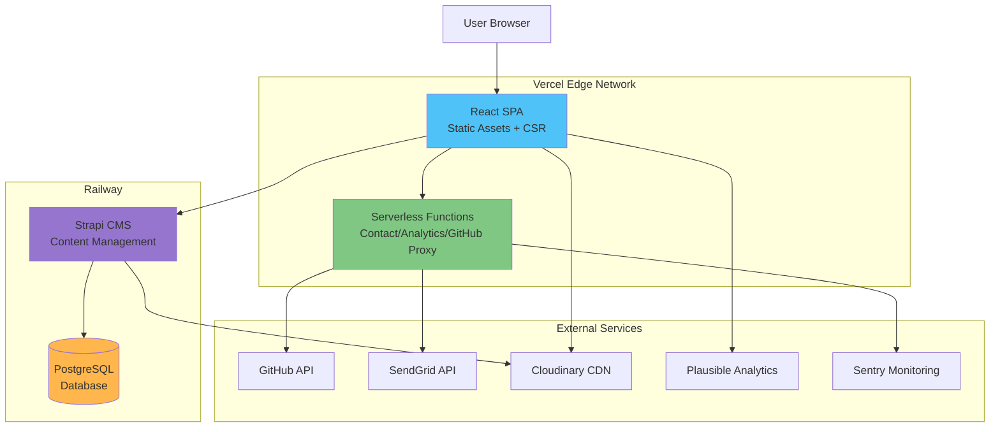
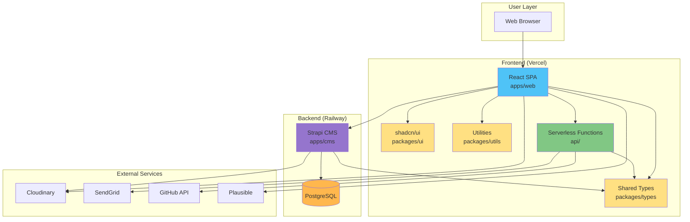
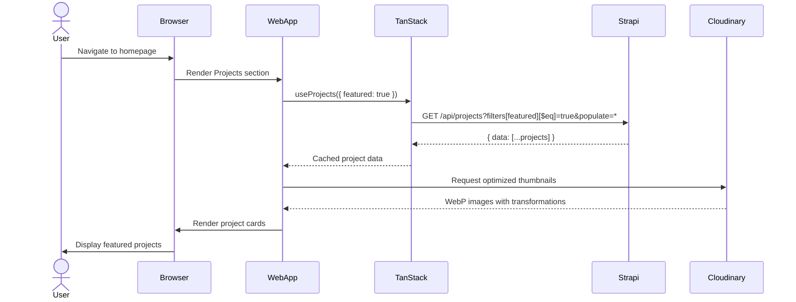
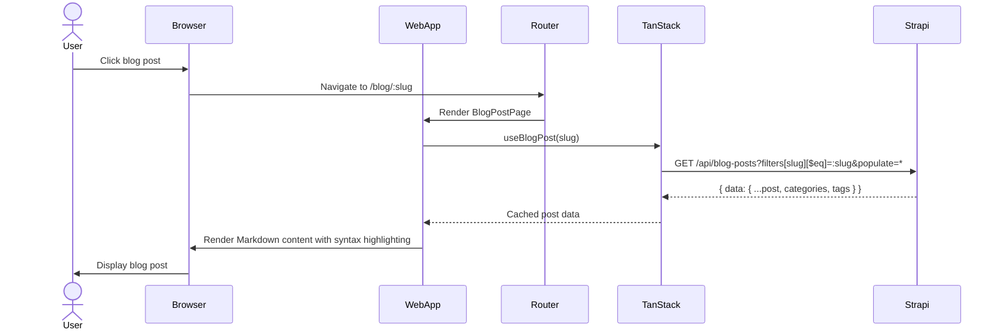
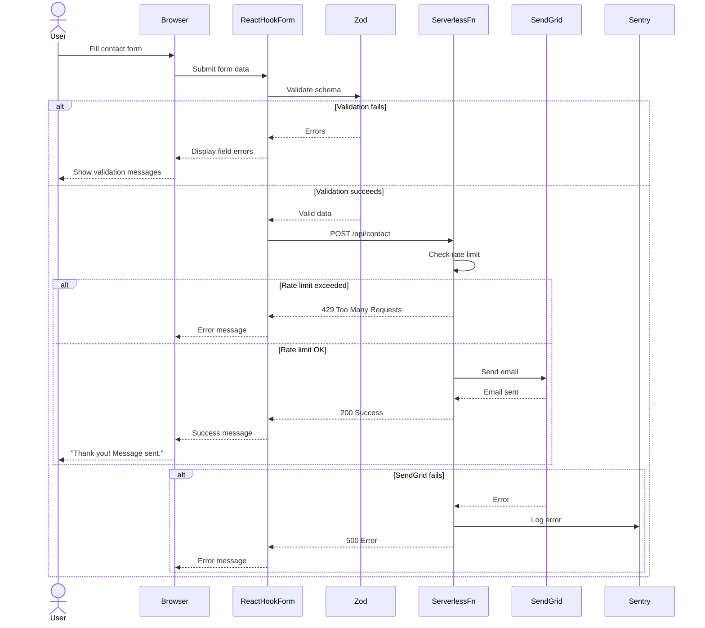
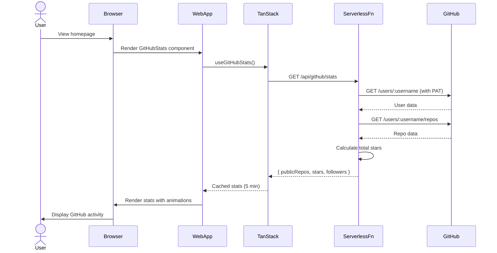
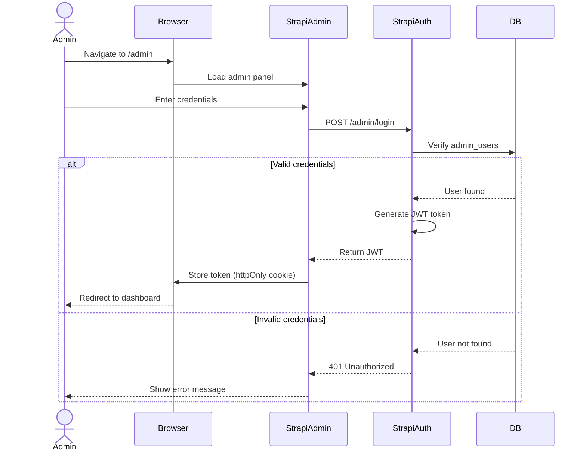
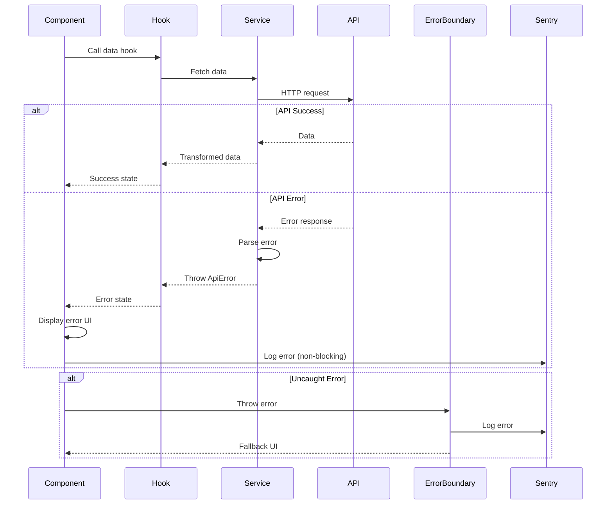

# Portfolio Fullstack Architecture Document

<!-- Powered by BMAD™ Core -->

## 1. Introduction

This document outlines the complete fullstack architecture for Dave Charm Bulaquena's professional portfolio, including backend systems, frontend implementation, and their integration. It serves as the single source of truth for AI-driven development, ensuring consistency across the entire technology stack.

This unified approach combines what would traditionally be separate backend and frontend architecture documents, streamlining the development process for modern fullstack applications where these concerns are increasingly intertwined.

### 1.1 Starter Template or Existing Project

**Status:** Greenfield project with Magic Patterns starter template as base

The project builds upon the **Magic Patterns Vite + React starter template** which provides:
- Basic Vite configuration with React 18.3
- TypeScript setup
- Tailwind CSS pre-configured
- Modern build tooling foundation

**Constraints imposed:**
- Must retain Vite as build tool (already configured)
- TypeScript configuration base is established
- Tailwind CSS framework is locked in

**What can be modified:**
- Component architecture is completely flexible
- State management can be added
- Router can be integrated
- Testing infrastructure needs to be added
- Monorepo structure wraps around this starter

The Magic Patterns starter accelerates initial setup but does not impose significant architectural constraints. All planned features (Strapi CMS, monorepo, shadcn/ui, blog platform) can be integrated seamlessly.

### 1.2 Change Log

| Date | Version | Description | Author |
|------|---------|-------------|--------|
| 2025-10-18 | 1.0 | Initial architecture document | Winston (Architect Agent) |

---

## 2. High Level Architecture

### 2.1 Technical Summary

This portfolio implements a **modern Jamstack architecture** combining static site generation with serverless backend functions and a headless CMS. The frontend leverages **React 18.3 with TypeScript 5.5+** built on **Vite 5.2**, utilizing **shadcn/ui** components for a unique design system while maintaining accessibility and performance. The backend consists of a self-hosted **Strapi v4 headless CMS** providing content management capabilities and **Vercel serverless functions** for transactional operations (contact form, visit tracking, GitHub API proxying). All components are organized in a **pnpm monorepo** enabling shared TypeScript types and utilities across frontend, backend, and shared packages. The infrastructure deploys to **Vercel's edge network** (frontend) and **Railway** (Strapi CMS with PostgreSQL), ensuring global performance with sub-1.5s First Contentful Paint and 90+ Lighthouse scores. This architecture achieves the PRD's dual goals of showcasing both technical development skills and solutions design expertise through a performant, accessible, and visually distinctive portfolio platform.

### 2.2 Platform and Infrastructure Choice

**Platform:** Vercel (Frontend) + Railway (Backend/CMS)

**Key Services:**
- **Vercel Edge Network:** Frontend hosting, serverless functions, automatic SSL, global CDN, preview deployments
- **Railway:** Strapi CMS hosting, managed PostgreSQL database, automatic deployments from git
- **Cloudinary:** Image and media asset management with automatic optimization
- **SendGrid:** Transactional email service for contact form submissions
- **GitHub API:** Real-time developer stats and repository showcase
- **Plausible Analytics:** Privacy-friendly analytics and visit tracking
- **Sentry:** Error tracking and performance monitoring across frontend and serverless functions

**Deployment Regions:**
- **Frontend:** Global edge deployment (Vercel CDN)
- **Backend:** US West (Railway default region, configurable)
- **Database:** Colocated with Railway backend

**Rationale:**
This platform combination offers the best developer experience with excellent free tiers, seamless GitHub integration, automatic preview deployments, and minimal DevOps overhead. Vercel's edge network ensures optimal frontend performance globally, while Railway provides a straightforward Strapi hosting experience with managed PostgreSQL. Both platforms support the monorepo structure and environment-based deployments.

### 2.3 Repository Structure

**Structure:** Monorepo

**Monorepo Tool:** pnpm workspaces

**Package Organization:**
```
/portfolio (root)
├── apps/
│   ├── web/           # Frontend React application (Vite + React)
│   └── cms/           # Strapi CMS backend (Node.js + TypeScript)
├── packages/
│   ├── ui/            # shadcn/ui components library
│   ├── types/         # Shared TypeScript interfaces/types
│   └── utils/         # Shared utilities and helpers
├── docs/              # All documentation (PRD, architecture, etc.)
└── .github/workflows/ # CI/CD pipelines
```

**Rationale:**
- **Type Safety:** Shared types between frontend and Strapi ensure consistency
- **Component Reusability:** shadcn/ui components managed as internal package
- **Unified Development:** Single install, coordinated builds, shared tooling
- **Efficient CI/CD:** Build only changed packages, parallel execution
- **pnpm Benefits:** Faster installs, efficient disk usage, strict dependency resolution

### 2.4 High Level Architecture Diagram



### 2.5 Architectural Patterns

- **Jamstack Architecture:** Pre-rendered frontend with dynamic content fetched from APIs at runtime - _Rationale:_ Optimal performance, security, and scalability for content-driven portfolio sites with global CDN distribution

- **Component-Based UI:** Reusable React components with TypeScript and shadcn/ui primitives - _Rationale:_ Maintainability, type safety, accessibility, and consistent design system across all pages

- **Headless CMS Pattern:** Content managed in Strapi, consumed via REST API - _Rationale:_ Decouples content from presentation, enables non-technical content updates, supports multiple content types (projects, blog, testimonials)

- **Serverless Functions:** Edge functions for transactional operations - _Rationale:_ Minimal backend complexity, automatic scaling, cost-effective for low-traffic portfolio use cases

- **Repository Pattern:** Data access abstracted behind service layer - _Rationale:_ Clean separation between UI and data fetching, easier testing, future API migration flexibility

- **Container/Presentational Components:** Logic separated from presentation - _Rationale:_ Reusability, testability, clear component responsibilities

- **Error Boundary Pattern:** React error boundaries for graceful degradation - _Rationale:_ User experience preserved even when components fail, errors logged to Sentry

- **Progressive Enhancement:** Core content accessible without JavaScript - _Rationale:_ SEO optimization, accessibility, performance on slow networks

---

## 3. Tech Stack

| Category | Technology | Version | Purpose | Rationale |
|----------|-----------|---------|---------|-----------|
| Frontend Language | TypeScript | 5.5+ | Primary language for frontend | Type safety, better DX, catch errors at compile time |
| Frontend Framework | React | 18.3+ | UI framework | Industry standard, excellent ecosystem, component model |
| UI Component Library | shadcn/ui | Latest | Component primitives | Customizable, accessible (Radix UI), not generic templates |
| CSS Framework | Tailwind CSS | 3.4.17 | Styling | Utility-first, required for shadcn/ui, rapid development |
| Build Tool | Vite | 5.2+ | Dev server & build | Fast HMR, optimized builds, native ESM support |
| State Management (Server) | TanStack Query | 5.x | Server state/caching | Smart caching, auto-refetch, optimistic updates |
| State Management (UI) | React Context + Hooks | React 18.3+ | Client state | Built-in, simple for UI state (theme, modals) |
| Routing | React Router | 6.x | Client-side routing | Standard React routing, supports blog navigation |
| Form Handling | React Hook Form | 7.x | Form state management | Performance, easy validation integration |
| Validation | Zod | 3.x | Schema validation | Type inference, runtime safety, works with RHF |
| Animations | Framer Motion | 11.x | UI animations | Declarative, performant, dark mode transitions |
| Icons | Lucide React | Latest | Icon system | Consistent, tree-shakeable, shadcn/ui compatible |
| Backend Language | Node.js + TypeScript | 20+ LTS | Runtime for Strapi and serverless | Unified language across stack, excellent CMS ecosystem |
| Backend Framework | Strapi | 4.25+ | Headless CMS | Content management, auto-generated API, admin panel |
| API Style | REST | Strapi default | API communication | Simple, cacheable, Strapi default, sufficient for use case |
| Database | PostgreSQL | 15+ | Primary database | Relational data, ACID compliance, Railway managed |
| File Storage | Cloudinary | Latest API | Image/media storage | Optimization, transformations, CDN delivery |
| Authentication | Strapi Auth | Strapi 4.25+ | CMS admin auth | Built-in with Strapi, role-based access control |
| Frontend Testing | Vitest | 2.x | Unit/integration tests | Fast, Vite-native, Jest-compatible API |
| Backend Testing | Vitest | 2.x | Backend unit tests | Consistent tooling across monorepo |
| E2E Testing | Playwright | 1.x | End-to-end tests | Cross-browser, reliable, built-in assertions |
| Accessibility Testing | @axe-core/playwright | Latest | A11y validation | Automated WCAG compliance checks |
| Package Manager | pnpm | 9.x | Dependency management | Fast, efficient, strict, monorepo support |
| Monorepo Tool | pnpm workspaces | pnpm 9.x | Monorepo management | Built-in with pnpm, simple configuration |
| Linting | ESLint | 9.x | Code quality | Standard linting, catch bugs early |
| Formatting | Prettier | 3.x | Code formatting | Consistent code style across team/AI |
| Git Hooks | Husky + lint-staged | Latest | Pre-commit checks | Enforce quality before commits |
| CI/CD | GitHub Actions | N/A | Automation | Free, integrated with GitHub, supports monorepo |
| Frontend Hosting | Vercel | N/A | Frontend deployment | Edge network, preview deploys, zero config |
| Backend Hosting | Railway | N/A | Strapi + DB hosting | Simple Strapi setup, managed PostgreSQL |
| Error Tracking | Sentry | Latest SDK | Error monitoring | Comprehensive error tracking, performance insights |
| Analytics | Plausible | Latest script | Privacy-friendly analytics | GDPR compliant, lightweight, no cookies |
| Email Service | SendGrid | Latest API | Transactional emails | Reliable delivery, good free tier, simple API |
| Performance Monitoring | Vercel Analytics | Vercel default | Web Vitals tracking | Built-in with Vercel, Core Web Vitals |

---

## 4. Data Models

### 4.1 Project

**Purpose:** Represents portfolio projects with rich media, technical details, and external links. Core content type for showcasing work.

**Key Attributes:**
- `id`: number - Unique identifier
- `title`: string - Project name
- `slug`: string - URL-friendly identifier
- `description`: string - Rich text project description (Markdown)
- `shortDescription`: string - Brief summary for cards
- `featured`: boolean - Featured on homepage
- `order`: number - Display order
- `technologies`: string[] - Tech stack used
- `category`: string - Project type (Web App, Mobile, etc.)
- `githubUrl`: string | null - GitHub repository link
- `liveUrl`: string | null - Live demo link
- `caseStudyUrl`: string | null - Detailed case study link
- `images`: Image[] - Project screenshots/gallery
- `thumbnail`: Image - Card thumbnail
- `startDate`: Date - Project start
- `endDate`: Date | null - Project end (null if ongoing)
- `publishedAt`: Date | null - Published timestamp
- `createdAt`: Date - Record creation
- `updatedAt`: Date - Last modification

**TypeScript Interface:**
```typescript
export interface Project {
  id: number;
  title: string;
  slug: string;
  description: string;
  shortDescription: string;
  featured: boolean;
  order: number;
  technologies: string[];
  category: string;
  githubUrl: string | null;
  liveUrl: string | null;
  caseStudyUrl: string | null;
  images: Image[];
  thumbnail: Image;
  startDate: Date;
  endDate: Date | null;
  publishedAt: Date | null;
  createdAt: Date;
  updatedAt: Date;
}

export interface Image {
  id: number;
  url: string;
  alternativeText: string;
  width: number;
  height: number;
  formats?: {
    thumbnail?: ImageFormat;
    small?: ImageFormat;
    medium?: ImageFormat;
    large?: ImageFormat;
  };
}

export interface ImageFormat {
  url: string;
  width: number;
  height: number;
}
```

**Relationships:**
- Has many: Images (gallery)
- Belongs to many: Categories (via category field)
- Referenced by: None

---

### 4.2 BlogPost

**Purpose:** Blog content for technical articles, tutorials, and insights. Supports rich Markdown content with code highlighting.

**Key Attributes:**
- `id`: number - Unique identifier
- `title`: string - Post title
- `slug`: string - URL-friendly identifier
- `content`: string - Full Markdown content
- `excerpt`: string - Short summary
- `coverImage`: Image - Featured image
- `author`: string - Author name (default: Dave Charm Bulaquena)
- `publishedAt`: Date | null - Publication date
- `readingTime`: number - Estimated minutes
- `featured`: boolean - Featured post
- `tags`: Tag[] - Associated tags
- `categories`: Category[] - Associated categories
- `seoTitle`: string | null - Custom SEO title
- `seoDescription`: string | null - Custom SEO description
- `createdAt`: Date - Record creation
- `updatedAt`: Date - Last modification

**TypeScript Interface:**
```typescript
export interface BlogPost {
  id: number;
  title: string;
  slug: string;
  content: string;
  excerpt: string;
  coverImage: Image;
  author: string;
  publishedAt: Date | null;
  readingTime: number;
  featured: boolean;
  tags: Tag[];
  categories: Category[];
  seoTitle: string | null;
  seoDescription: string | null;
  createdAt: Date;
  updatedAt: Date;
}
```

**Relationships:**
- Has one: Image (coverImage)
- Has many: Tags (many-to-many)
- Has many: Categories (many-to-many)

---

### 4.3 Category

**Purpose:** Organize blog posts into broad topics (e.g., "Frontend", "DevOps", "Design")

**Key Attributes:**
- `id`: number - Unique identifier
- `name`: string - Category name
- `slug`: string - URL-friendly identifier
- `description`: string | null - Category description
- `createdAt`: Date - Record creation
- `updatedAt`: Date - Last modification

**TypeScript Interface:**
```typescript
export interface Category {
  id: number;
  name: string;
  slug: string;
  description: string | null;
  createdAt: Date;
  updatedAt: Date;
}
```

**Relationships:**
- Belongs to many: BlogPosts (many-to-many)

---

### 4.4 Tag

**Purpose:** Fine-grained topics for blog posts (e.g., "React", "TypeScript", "Performance")

**Key Attributes:**
- `id`: number - Unique identifier
- `name`: string - Tag name
- `slug`: string - URL-friendly identifier
- `createdAt`: Date - Record creation
- `updatedAt`: Date - Last modification

**TypeScript Interface:**
```typescript
export interface Tag {
  id: number;
  name: string;
  slug: string;
  createdAt: Date;
  updatedAt: Date;
}
```

**Relationships:**
- Belongs to many: BlogPosts (many-to-many)

---

### 4.5 Testimonial

**Purpose:** Client/colleague recommendations and endorsements to build credibility

**Key Attributes:**
- `id`: number - Unique identifier
- `name`: string - Person's name
- `title`: string - Job title
- `company`: string - Company name
- `content`: string - Testimonial text
- `avatar`: Image | null - Profile picture
- `linkedinUrl`: string | null - LinkedIn profile
- `order`: number - Display order
- `featured`: boolean - Display on homepage
- `publishedAt`: Date | null - Publication date
- `createdAt`: Date - Record creation
- `updatedAt`: Date - Last modification

**TypeScript Interface:**
```typescript
export interface Testimonial {
  id: number;
  name: string;
  title: string;
  company: string;
  content: string;
  avatar: Image | null;
  linkedinUrl: string | null;
  order: number;
  featured: boolean;
  publishedAt: Date | null;
  createdAt: Date;
  updatedAt: Date;
}
```

**Relationships:**
- Has one: Image (avatar, optional)

---

## 5. API Specification

### 5.1 Strapi REST API

All Strapi endpoints follow REST conventions with automatic API generation.

**Base URL:** `https://api.davebulaquena.com` (production) / `http://localhost:1337` (development)

**Authentication:**
- Public endpoints (read-only): No auth required
- Admin endpoints: Bearer token (Strapi admin panel)

**Common Response Format:**
```typescript
{
  data: {
    id: number;
    attributes: {
      // Entity fields
    };
  },
  meta: {
    pagination?: {
      page: number;
      pageSize: number;
      pageCount: number;
      total: number;
    };
  }
}
```

**Key Endpoints:**

#### Projects
- `GET /api/projects` - List all published projects
  - Query params: `filters[featured][$eq]=true`, `populate=*`, `sort=order:asc`
- `GET /api/projects/:id` - Get project by ID
- `GET /api/projects?filters[slug][$eq]=:slug` - Get project by slug

#### Blog Posts
- `GET /api/blog-posts` - List all published posts
  - Query params: `filters[publishedAt][$notNull]=true`, `populate=*`, `sort=publishedAt:desc`, `pagination[page]=1&pagination[pageSize]=10`
- `GET /api/blog-posts?filters[slug][$eq]=:slug` - Get post by slug
- `GET /api/blog-posts?filters[featured][$eq]=true` - Get featured posts

#### Categories
- `GET /api/categories` - List all categories
- `GET /api/categories/:id?populate=blog_posts` - Get category with posts

#### Tags
- `GET /api/tags` - List all tags
- `GET /api/tags/:id?populate=blog_posts` - Get tag with posts

#### Testimonials
- `GET /api/testimonials?filters[publishedAt][$notNull]=true&sort=order:asc` - List published testimonials
- `GET /api/testimonials?filters[featured][$eq]=true` - Get featured testimonials

### 5.2 Serverless Function Endpoints

Deployed to Vercel as edge functions.

**Base URL:** `https://davebulaquena.com/api` (production) / `http://localhost:3000/api` (development)

#### Contact Form
- `POST /api/contact`
  - Request Body:
    ```typescript
    {
      name: string;
      email: string;
      subject: string;
      message: string;
    }
    ```
  - Response:
    ```typescript
    {
      success: boolean;
      message: string;
    }
    ```
  - Rate limit: 5 requests per IP per hour

#### Visit Counter
- `GET /api/visits` - Get current visit count
  - Response:
    ```typescript
    {
      count: number;
    }
    ```
- `POST /api/visits` - Increment visit count (called on page load)
  - Response:
    ```typescript
    {
      count: number;
    }
    ```

#### GitHub Stats Proxy
- `GET /api/github/stats` - Get GitHub user stats
  - Response:
    ```typescript
    {
      publicRepos: number;
      followers: number;
      following: number;
      totalStars: number;
      contributions: number;
    }
    ```
- `GET /api/github/repos` - Get pinned/featured repositories
  - Response:
    ```typescript
    {
      repos: Array<{
        name: string;
        description: string;
        url: string;
        stars: number;
        forks: number;
        language: string;
      }>;
    }
    ```

---

## 6. Components

### 6.1 Frontend Application (Web SPA)

**Responsibility:** User-facing React application providing portfolio content, blog platform, and interactive features

**Key Interfaces:**
- Consumes Strapi REST API for dynamic content
- Calls Vercel serverless functions for transactional operations
- Integrates with external services (Cloudinary for images, Plausible for analytics)

**Dependencies:** Strapi CMS API, Serverless Functions, Cloudinary CDN

**Technology Stack:** React 18.3, TypeScript 5.5, Vite 5.2, shadcn/ui, Tailwind CSS, TanStack Query, React Router, React Hook Form + Zod, Framer Motion

---

### 6.2 Strapi CMS

**Responsibility:** Content management system for projects, blog posts, testimonials, and media assets

**Key Interfaces:**
- REST API for content delivery
- Admin panel for content editing
- Media library with Cloudinary integration

**Dependencies:** PostgreSQL database, Cloudinary storage

**Technology Stack:** Strapi 4.25+, Node.js 20, TypeScript, PostgreSQL 15+

---

### 6.3 Serverless Functions

**Responsibility:** Backend logic for contact form processing, visit tracking, and GitHub API proxying

**Key Interfaces:**
- HTTP endpoints exposed to frontend
- SendGrid API for email delivery
- GitHub API for developer stats
- Sentry for error logging

**Dependencies:** SendGrid, GitHub API, Sentry

**Technology Stack:** Vercel Serverless Functions, Node.js 20, TypeScript

---

### 6.4 Shared Packages

**Responsibility:** Type definitions, utilities, and UI components shared across apps

**Key Interfaces:**
- TypeScript types exported to apps/web and apps/cms
- Utility functions for validation, formatting, etc.
- shadcn/ui component library

**Dependencies:** None (consumed by other packages)

**Technology Stack:** TypeScript, React (for UI package)

---

### 6.5 PostgreSQL Database

**Responsibility:** Persistent storage for all CMS content (projects, blog posts, users, etc.)

**Key Interfaces:**
- Direct connection from Strapi backend
- Managed by Railway with automatic backups

**Dependencies:** None

**Technology Stack:** PostgreSQL 15+, Railway managed

---

### 6.6 Cloudinary CDN

**Responsibility:** Image and media asset storage, optimization, and delivery

**Key Interfaces:**
- Upload API from Strapi media library
- Public CDN URLs for image delivery
- Transformation API for responsive images

**Dependencies:** None

**Technology Stack:** Cloudinary API

---

### 6.7 SendGrid Email Service

**Responsibility:** Transactional email delivery for contact form submissions

**Key Interfaces:**
- REST API called from serverless functions
- Email templates for contact notifications

**Dependencies:** None

**Technology Stack:** SendGrid API v3

---

### 6.8 GitHub API

**Responsibility:** Real-time developer statistics and repository data

**Key Interfaces:**
- REST API v3 for user stats
- GraphQL API v4 for contribution graphs

**Dependencies:** None (external service)

**Technology Stack:** GitHub REST API v3, GitHub GraphQL API v4

---

### 6.9 Plausible Analytics

**Responsibility:** Privacy-friendly analytics and visit tracking

**Key Interfaces:**
- JavaScript tracking script embedded in frontend
- Public stats API (optional for displaying metrics)

**Dependencies:** None

**Technology Stack:** Plausible script

---

### 6.10 Component Diagrams



---

## 7. External APIs

### 7.1 GitHub API

- **Purpose:** Fetch real-time developer statistics, repository data, and contribution graphs to showcase technical activity
- **Documentation:** https://docs.github.com/en/rest
- **Base URL(s):**
  - REST API: `https://api.github.com`
  - GraphQL API: `https://api.github.com/graphql`
- **Authentication:** Personal Access Token (PAT) stored in serverless function environment
- **Rate Limits:**
  - Authenticated: 5,000 requests/hour
  - Unauthenticated: 60 requests/hour

**Key Endpoints Used:**
- `GET /users/:username` - Get user profile and public stats
- `GET /users/:username/repos` - List user repositories with stars/forks
- `GET /search/repositories?q=user::username+sort:stars` - Get top repositories by stars
- GraphQL query for contribution graph data

**Integration Notes:** All GitHub API calls proxied through serverless function to protect PAT. Frontend never calls GitHub directly. Implement caching (5-10 minutes) to reduce API calls.

---

### 7.2 SendGrid API

- **Purpose:** Send contact form submissions via transactional email
- **Documentation:** https://docs.sendgrid.com/api-reference/mail-send/mail-send
- **Base URL(s):** `https://api.sendgrid.com/v3`
- **Authentication:** API Key (stored in serverless function environment)
- **Rate Limits:** Free tier: 100 emails/day, 40,000 emails/month

**Key Endpoints Used:**
- `POST /mail/send` - Send email with template or plain content

**Integration Notes:** Use dynamic email templates with contact form data. Include reply-to header with user's email. Implement rate limiting on serverless function to prevent abuse (5 submissions per IP per hour).

---

### 7.3 Cloudinary API

- **Purpose:** Image upload, storage, transformation, and CDN delivery for all portfolio media
- **Documentation:** https://cloudinary.com/documentation
- **Base URL(s):**
  - Upload: `https://api.cloudinary.com/v1_1/:cloud_name`
  - Delivery: `https://res.cloudinary.com/:cloud_name`
- **Authentication:** API Key + Secret for uploads (Strapi integration), unsigned URLs for delivery
- **Rate Limits:** Free tier: 25 GB storage, 25 GB bandwidth/month

**Key Endpoints Used:**
- `POST /image/upload` - Upload images from Strapi admin
- `GET /:cloud_name/image/upload/:transformation/:public_id` - Deliver optimized images

**Integration Notes:** Integrated directly with Strapi media library via official plugin (`@strapi/provider-upload-cloudinary`). Automatic WebP conversion and responsive image generation.

---

### 7.4 Plausible Analytics API

- **Purpose:** Privacy-friendly analytics for visit tracking and user behavior insights
- **Documentation:** https://plausible.io/docs
- **Base URL(s):**
  - Script: `https://plausible.io/js/script.js`
  - Stats API: `https://plausible.io/api/v1`
- **Authentication:** API key for stats API (optional, only if displaying public stats)
- **Rate Limits:** No strict limits on script, API limits based on plan

**Key Endpoints Used:**
- Script inclusion for automatic tracking (no endpoint)
- `GET /api/v1/stats/aggregate?site_id=:domain&period=30d&metrics=visitors` - Get visit count (optional)

**Integration Notes:** Primary tracking via script tag in HTML. Optional: Fetch aggregate stats for "Total Visitors" counter display. No cookies, GDPR compliant by default.

---

## 8. Core Workflows

### 8.1 Project Display Workflow



---

### 8.2 Blog Post Reading Workflow



---

### 8.3 Contact Form Submission Workflow



---

### 8.4 GitHub Stats Display Workflow



---

## 9. Database Schema

### 9.1 PostgreSQL Schema (Strapi-managed)

Strapi auto-generates database tables based on content types. Below is the logical schema:

```sql
-- Projects Table
CREATE TABLE projects (
    id SERIAL PRIMARY KEY,
    title VARCHAR(255) NOT NULL,
    slug VARCHAR(255) UNIQUE NOT NULL,
    description TEXT NOT NULL,
    short_description VARCHAR(500),
    featured BOOLEAN DEFAULT FALSE,
    order_index INTEGER DEFAULT 0,
    technologies JSONB, -- Array of strings
    category VARCHAR(100),
    github_url VARCHAR(500),
    live_url VARCHAR(500),
    case_study_url VARCHAR(500),
    start_date DATE,
    end_date DATE,
    published_at TIMESTAMP,
    created_at TIMESTAMP DEFAULT NOW(),
    updated_at TIMESTAMP DEFAULT NOW(),
    created_by_id INTEGER REFERENCES admin_users(id),
    updated_by_id INTEGER REFERENCES admin_users(id)
);

-- Blog Posts Table
CREATE TABLE blog_posts (
    id SERIAL PRIMARY KEY,
    title VARCHAR(255) NOT NULL,
    slug VARCHAR(255) UNIQUE NOT NULL,
    content TEXT NOT NULL,
    excerpt VARCHAR(500),
    author VARCHAR(255) DEFAULT 'Dave Charm Bulaquena',
    reading_time INTEGER,
    featured BOOLEAN DEFAULT FALSE,
    seo_title VARCHAR(255),
    seo_description VARCHAR(500),
    published_at TIMESTAMP,
    created_at TIMESTAMP DEFAULT NOW(),
    updated_at TIMESTAMP DEFAULT NOW(),
    created_by_id INTEGER REFERENCES admin_users(id),
    updated_by_id INTEGER REFERENCES admin_users(id)
);

-- Categories Table
CREATE TABLE categories (
    id SERIAL PRIMARY KEY,
    name VARCHAR(100) NOT NULL,
    slug VARCHAR(100) UNIQUE NOT NULL,
    description TEXT,
    created_at TIMESTAMP DEFAULT NOW(),
    updated_at TIMESTAMP DEFAULT NOW()
);

-- Tags Table
CREATE TABLE tags (
    id SERIAL PRIMARY KEY,
    name VARCHAR(100) NOT NULL,
    slug VARCHAR(100) UNIQUE NOT NULL,
    created_at TIMESTAMP DEFAULT NOW(),
    updated_at TIMESTAMP DEFAULT NOW()
);

-- Blog Posts <-> Categories (Many-to-Many)
CREATE TABLE blog_posts_categories_links (
    id SERIAL PRIMARY KEY,
    blog_post_id INTEGER REFERENCES blog_posts(id) ON DELETE CASCADE,
    category_id INTEGER REFERENCES categories(id) ON DELETE CASCADE,
    blog_post_order INTEGER,
    category_order INTEGER
);

-- Blog Posts <-> Tags (Many-to-Many)
CREATE TABLE blog_posts_tags_links (
    id SERIAL PRIMARY KEY,
    blog_post_id INTEGER REFERENCES blog_posts(id) ON DELETE CASCADE,
    tag_id INTEGER REFERENCES tags(id) ON DELETE CASCADE,
    blog_post_order INTEGER,
    tag_order INTEGER
);

-- Testimonials Table
CREATE TABLE testimonials (
    id SERIAL PRIMARY KEY,
    name VARCHAR(255) NOT NULL,
    title VARCHAR(255),
    company VARCHAR(255),
    content TEXT NOT NULL,
    linkedin_url VARCHAR(500),
    order_index INTEGER DEFAULT 0,
    featured BOOLEAN DEFAULT FALSE,
    published_at TIMESTAMP,
    created_at TIMESTAMP DEFAULT NOW(),
    updated_at TIMESTAMP DEFAULT NOW(),
    created_by_id INTEGER REFERENCES admin_users(id),
    updated_by_id INTEGER REFERENCES admin_users(id)
);

-- Files Table (Strapi media library)
CREATE TABLE files (
    id SERIAL PRIMARY KEY,
    name VARCHAR(255) NOT NULL,
    alternative_text VARCHAR(255),
    caption VARCHAR(255),
    width INTEGER,
    height INTEGER,
    formats JSONB, -- Thumbnails, medium, large
    hash VARCHAR(255) NOT NULL,
    ext VARCHAR(10),
    mime VARCHAR(255),
    size DECIMAL(10, 2),
    url VARCHAR(500) NOT NULL, -- Cloudinary URL
    preview_url VARCHAR(500),
    provider VARCHAR(50) DEFAULT 'cloudinary',
    provider_metadata JSONB,
    created_at TIMESTAMP DEFAULT NOW(),
    updated_at TIMESTAMP DEFAULT NOW()
);

-- Admin Users Table (Strapi built-in)
CREATE TABLE admin_users (
    id SERIAL PRIMARY KEY,
    firstname VARCHAR(255),
    lastname VARCHAR(255),
    username VARCHAR(255) UNIQUE,
    email VARCHAR(255) UNIQUE NOT NULL,
    password VARCHAR(255) NOT NULL,
    reset_password_token VARCHAR(255),
    registration_token VARCHAR(255),
    is_active BOOLEAN DEFAULT TRUE,
    blocked BOOLEAN DEFAULT FALSE,
    prefered_language VARCHAR(10),
    created_at TIMESTAMP DEFAULT NOW(),
    updated_at TIMESTAMP DEFAULT NOW()
);

-- Indexes for performance
CREATE INDEX idx_projects_slug ON projects(slug);
CREATE INDEX idx_projects_featured ON projects(featured) WHERE featured = TRUE;
CREATE INDEX idx_projects_published ON projects(published_at) WHERE published_at IS NOT NULL;

CREATE INDEX idx_blog_posts_slug ON blog_posts(slug);
CREATE INDEX idx_blog_posts_published ON blog_posts(published_at DESC) WHERE published_at IS NOT NULL;
CREATE INDEX idx_blog_posts_featured ON blog_posts(featured) WHERE featured = TRUE;

CREATE INDEX idx_categories_slug ON categories(slug);
CREATE INDEX idx_tags_slug ON tags(slug);

CREATE INDEX idx_testimonials_featured ON testimonials(featured) WHERE featured = TRUE;
CREATE INDEX idx_testimonials_published ON testimonials(published_at) WHERE published_at IS NOT NULL;
```

**Key Design Decisions:**
- **JSONB for arrays:** `technologies` stored as JSONB for flexibility and queryability
- **Slug indexes:** All slug fields indexed for fast lookup by URL
- **Partial indexes:** Featured and published items indexed separately for homepage queries
- **Foreign keys:** Strapi admin user references for audit trail
- **Timestamps:** Created/updated timestamps on all tables for tracking
- **Soft deletes:** Strapi uses `published_at` for soft publishing (NULL = draft)

---

## 10. Frontend Architecture

### 10.1 Component Organization

```text
apps/web/src/
├── components/
│   ├── layout/
│   │   ├── Header.tsx              # Navigation, theme toggle
│   │   ├── Footer.tsx              # Footer with links, copyright
│   │   ├── Container.tsx           # Max-width wrapper
│   │   └── Section.tsx             # Section with spacing
│   ├── sections/
│   │   ├── Hero.tsx                # Homepage hero
│   │   ├── About.tsx               # About section
│   │   ├── Experience.tsx          # Work history
│   │   ├── Skills.tsx              # Tech skills
│   │   ├── Projects.tsx            # Featured projects
│   │   ├── Awards.tsx              # Achievements
│   │   ├── Testimonials.tsx        # Recommendations
│   │   └── Contact.tsx             # Contact section
│   ├── blog/
│   │   ├── BlogListing.tsx         # Blog post list with pagination
│   │   ├── BlogPostCard.tsx        # Individual post card
│   │   ├── BlogPostDetail.tsx      # Full blog post view
│   │   ├── MarkdownRenderer.tsx    # Markdown + code highlighting
│   │   ├── CategoryFilter.tsx      # Filter by category
│   │   └── TagCloud.tsx            # Tag navigation
│   ├── github/
│   │   ├── GitHubStats.tsx         # Stats display (repos, stars)
│   │   ├── RepoShowcase.tsx        # Pinned repositories
│   │   └── ContributionGraph.tsx   # Contribution calendar
│   ├── common/
│   │   ├── ThemeToggle.tsx         # Dark mode toggle
│   │   ├── ScrollToTop.tsx         # Scroll to top button
│   │   ├── LoadingSkeleton.tsx     # Loading placeholder
│   │   ├── ErrorBoundary.tsx       # Error boundary wrapper
│   │   ├── ErrorMessage.tsx        # Error display
│   │   └── SEO.tsx                 # SEO meta tags component
│   ├── forms/
│   │   ├── ContactForm.tsx         # Contact form with validation
│   │   ├── FormField.tsx           # Reusable form field
│   │   └── FormError.tsx           # Error message display
│   └── ui/                         # shadcn/ui components (from packages/ui)
│       ├── button.tsx
│       ├── card.tsx
│       ├── input.tsx
│       ├── textarea.tsx
│       ├── dialog.tsx
│       └── ...
├── pages/
│   ├── HomePage.tsx                # Main portfolio page
│   ├── BlogListingPage.tsx         # Blog listing page
│   ├── BlogPostPage.tsx            # Individual blog post page
│   └── NotFoundPage.tsx            # 404 page
├── hooks/
│   ├── useProjects.ts              # TanStack Query hook for projects
│   ├── useBlogPosts.ts             # TanStack Query hook for blog
│   ├── useGitHubStats.ts           # GitHub stats hook
│   ├── useContactForm.ts           # Contact form submission hook
│   ├── useTheme.ts                 # Theme context hook
│   └── useScrollSpy.ts             # Active section detection
├── services/
│   ├── api.ts                      # API client setup
│   ├── strapi.ts                   # Strapi-specific API calls
│   ├── github.ts                   # GitHub API calls (via proxy)
│   └── contact.ts                  # Contact form API
├── contexts/
│   ├── ThemeContext.tsx            # Theme provider
│   └── index.ts                    # Context exports
├── lib/
│   ├── utils.ts                    # Utility functions (cn, etc.)
│   └── constants.ts                # App constants
├── styles/
│   ├── globals.css                 # Global styles, Tailwind imports
│   └── themes.css                  # Theme variables
├── types/
│   └── index.ts                    # Frontend-specific types (imports from @portfolio/types)
├── App.tsx                         # Root app component with providers
└── main.tsx                        # Entry point
```

### 10.2 Standard Component Pattern

All components follow this template for consistency:

```typescript
import { type FC } from 'react';
import { Container } from '@/components/layout/Container';
import { LoadingSkeleton } from '@/components/common/LoadingSkeleton';
import { ErrorMessage } from '@/components/common/ErrorMessage';
import { useProjects } from '@/hooks/useProjects';
import type { Project } from '@portfolio/types';

export const Projects: FC = () => {
  const { data: projects, isLoading, error } = useProjects({ featured: true });

  if (isLoading) {
    return (
      <section id="projects" className="py-20">
        <Container>
          <LoadingSkeleton count={3} />
        </Container>
      </section>
    );
  }

  if (error) {
    return (
      <section id="projects" className="py-20">
        <Container>
          <ErrorMessage
            title="Failed to load projects"
            message="Please try again later."
          />
        </Container>
      </section>
    );
  }

  return (
    <section id="projects" className="py-20 bg-gray-50 dark:bg-gray-900">
      <Container>
        <h2 className="text-3xl font-bold mb-8">Featured Projects</h2>
        <div className="grid grid-cols-1 md:grid-cols-2 lg:grid-cols-3 gap-6">
          {projects?.map((project) => (
            <ProjectCard key={project.id} project={project} />
          ))}
        </div>
      </Container>
    </section>
  );
};
```

**Key Patterns:**
- Always handle loading, error, and success states
- Use skeleton loaders for better UX
- Graceful error messages with fallback UI
- TypeScript interfaces from shared package
- Tailwind classes with dark mode support
- Semantic HTML (section, Container wrapper)

### 10.3 State Management Architecture

#### Theme Context (UI State)

```typescript
// contexts/ThemeContext.tsx
import { createContext, useContext, useEffect, useState, type ReactNode } from 'react';

type Theme = 'light' | 'dark';

interface ThemeContextType {
  theme: Theme;
  toggleTheme: () => void;
}

const ThemeContext = createContext<ThemeContextType | undefined>(undefined);

export function ThemeProvider({ children }: { children: ReactNode }) {
  const [theme, setTheme] = useState<Theme>(() => {
    // Check localStorage first
    const stored = localStorage.getItem('theme');
    if (stored === 'light' || stored === 'dark') return stored;

    // Fall back to system preference
    return window.matchMedia('(prefers-color-scheme: dark)').matches
      ? 'dark'
      : 'light';
  });

  useEffect(() => {
    // Update document class and localStorage
    document.documentElement.classList.remove('light', 'dark');
    document.documentElement.classList.add(theme);
    localStorage.setItem('theme', theme);
  }, [theme]);

  const toggleTheme = () => {
    setTheme((prev) => (prev === 'light' ? 'dark' : 'light'));
  };

  return (
    <ThemeContext.Provider value={{ theme, toggleTheme }}>
      {children}
    </ThemeContext.Provider>
  );
}

export function useTheme() {
  const context = useContext(ThemeContext);
  if (!context) {
    throw new Error('useTheme must be used within ThemeProvider');
  }
  return context;
}
```

#### TanStack Query Setup (Server State)

```typescript
// App.tsx
import { QueryClient, QueryClientProvider } from '@tanstack/react-query';
import { ReactQueryDevtools } from '@tanstack/react-query-devtools';
import { BrowserRouter } from 'react-router-dom';
import { ThemeProvider } from '@/contexts/ThemeContext';
import { AppRoutes } from './routes';

const queryClient = new QueryClient({
  defaultOptions: {
    queries: {
      staleTime: 5 * 60 * 1000, // 5 minutes
      retry: 1,
      refetchOnWindowFocus: false,
    },
  },
});

export function App() {
  return (
    <QueryClientProvider client={queryClient}>
      <ThemeProvider>
        <BrowserRouter>
          <AppRoutes />
        </BrowserRouter>
      </ThemeProvider>
      <ReactQueryDevtools initialIsOpen={false} />
    </QueryClientProvider>
  );
}
```

**State Management Patterns:**
- **UI State:** React Context for theme, modals, UI preferences (simple, no external library needed)
- **Server State:** TanStack Query for all API data (automatic caching, refetching, background updates)
- **Form State:** React Hook Form for forms (performance, validation integration)
- **No global store:** Avoid Redux/Zustand complexity for simple portfolio use case

### 10.4 Routing Architecture

#### Route Organization

```typescript
// routes/index.tsx
import { Routes, Route } from 'react-router-dom';
import { HomePage } from '@/pages/HomePage';
import { BlogListingPage } from '@/pages/BlogListingPage';
import { BlogPostPage } from '@/pages/BlogPostPage';
import { NotFoundPage } from '@/pages/NotFoundPage';
import { Layout } from '@/components/layout/Layout';

export function AppRoutes() {
  return (
    <Layout>
      <Routes>
        <Route path="/" element={<HomePage />} />
        <Route path="/blog" element={<BlogListingPage />} />
        <Route path="/blog/:slug" element={<BlogPostPage />} />
        <Route path="*" element={<NotFoundPage />} />
      </Routes>
    </Layout>
  );
}
```

**Routing Strategy:**
- **Homepage (`/`):** Single-page with hash links to sections (#about, #projects, etc.)
- **Blog Listing (`/blog`):** Paginated list of blog posts
- **Blog Post (`/blog/:slug`):** Individual post with Markdown rendering
- **404 (`*`):** Catch-all for unknown routes

**Navigation:**
- Header navigation uses hash links on homepage
- Blog navigation uses React Router `Link` components
- Smooth scroll behavior for hash links

### 10.5 Frontend Services Layer

#### API Client Setup

```typescript
// services/api.ts
const STRAPI_URL = import.meta.env.VITE_STRAPI_API_URL || 'http://localhost:1337';

export interface StrapiResponse<T> {
  data: T;
  meta?: {
    pagination?: {
      page: number;
      pageSize: number;
      pageCount: number;
      total: number;
    };
  };
}

/**
 * Transform Strapi response format to clean data objects
 */
export function transformStrapiResponse<T>(data: any): T {
  if (Array.isArray(data.data)) {
    return data.data.map((item: any) => ({
      id: item.id,
      ...item.attributes,
    })) as T;
  }

  return {
    id: data.data.id,
    ...data.data.attributes,
  } as T;
}

/**
 * Base API fetch wrapper with error handling
 */
export async function apiFetch<T>(
  endpoint: string,
  options?: RequestInit
): Promise<T> {
  const url = endpoint.startsWith('http')
    ? endpoint
    : `${STRAPI_URL}${endpoint}`;

  const response = await fetch(url, {
    headers: {
      'Content-Type': 'application/json',
      ...options?.headers,
    },
    ...options,
  });

  if (!response.ok) {
    throw new Error(`API Error: ${response.status} ${response.statusText}`);
  }

  return await response.json();
}
```

#### Strapi Service Example

```typescript
// services/strapi.ts
import { apiFetch, transformStrapiResponse, type StrapiResponse } from './api';
import type { Project, BlogPost, Testimonial } from '@portfolio/types';

/**
 * Fetch projects from Strapi
 */
export async function getProjects(filters?: { featured?: boolean }): Promise<Project[]> {
  let endpoint = '/api/projects?filters[publishedAt][$notNull]=true&populate=*&sort=order:asc';

  if (filters?.featured) {
    endpoint += '&filters[featured][$eq]=true';
  }

  const data = await apiFetch<StrapiResponse<any>>(endpoint);
  return transformStrapiResponse<Project[]>(data);
}

/**
 * Fetch single project by slug
 */
export async function getProjectBySlug(slug: string): Promise<Project | null> {
  const endpoint = `/api/projects?filters[slug][$eq]=${slug}&populate=*`;
  const data = await apiFetch<StrapiResponse<any>>(endpoint);
  const projects = transformStrapiResponse<Project[]>(data);
  return projects[0] || null;
}

/**
 * Fetch blog posts with pagination
 */
export async function getBlogPosts(options?: {
  page?: number;
  pageSize?: number;
  featured?: boolean;
}): Promise<{ posts: BlogPost[]; pagination: any }> {
  const { page = 1, pageSize = 10, featured } = options || {};

  let endpoint = `/api/blog-posts?filters[publishedAt][$notNull]=true&populate=*&sort=publishedAt:desc&pagination[page]=${page}&pagination[pageSize]=${pageSize}`;

  if (featured) {
    endpoint += '&filters[featured][$eq]=true';
  }

  const data = await apiFetch<StrapiResponse<any>>(endpoint);

  return {
    posts: transformStrapiResponse<BlogPost[]>(data),
    pagination: data.meta?.pagination || {},
  };
}

/**
 * Fetch single blog post by slug
 */
export async function getBlogPostBySlug(slug: string): Promise<BlogPost | null> {
  const endpoint = `/api/blog-posts?filters[slug][$eq]=${slug}&populate=*`;
  const data = await apiFetch<StrapiResponse<any>>(endpoint);
  const posts = transformStrapiResponse<BlogPost[]>(data);
  return posts[0] || null;
}

/**
 * Fetch testimonials
 */
export async function getTestimonials(filters?: { featured?: boolean }): Promise<Testimonial[]> {
  let endpoint = '/api/testimonials?filters[publishedAt][$notNull]=true&populate=*&sort=order:asc';

  if (filters?.featured) {
    endpoint += '&filters[featured][$eq]=true';
  }

  const data = await apiFetch<StrapiResponse<any>>(endpoint);
  return transformStrapiResponse<Testimonial[]>(data);
}
```

#### TanStack Query Hooks

```typescript
// hooks/useProjects.ts
import { useQuery } from '@tanstack/react-query';
import { getProjects } from '@/services/strapi';

export function useProjects(filters?: { featured?: boolean }) {
  return useQuery({
    queryKey: ['projects', filters],
    queryFn: () => getProjects(filters),
    staleTime: 5 * 60 * 1000, // 5 minutes
  });
}

// hooks/useBlogPosts.ts
import { useQuery } from '@tanstack/react-query';
import { getBlogPosts } from '@/services/strapi';

export function useBlogPosts(options?: { page?: number; pageSize?: number }) {
  return useQuery({
    queryKey: ['blog-posts', options],
    queryFn: () => getBlogPosts(options),
    staleTime: 5 * 60 * 1000,
  });
}

// hooks/useGitHubStats.ts
import { useQuery } from '@tanstack/react-query';

interface GitHubStats {
  publicRepos: number;
  followers: number;
  following: number;
  totalStars: number;
}

async function fetchGitHubStats(): Promise<GitHubStats> {
  const response = await fetch('/api/github/stats');
  if (!response.ok) {
    throw new Error('Failed to fetch GitHub stats');
  }
  return await response.json();
}

export function useGitHubStats() {
  return useQuery({
    queryKey: ['github-stats'],
    queryFn: fetchGitHubStats,
    staleTime: 10 * 60 * 1000, // 10 minutes (longer cache for external API)
  });
}
```

**Service Layer Patterns:**
- All API calls abstracted into service functions
- TanStack Query hooks wrap service calls for caching
- Strapi response transformation centralized
- Error handling built into apiFetch
- TypeScript types from shared package ensure consistency

---

## 11. Backend Architecture

### 11.1 Service Architecture

This project uses a **hybrid serverless + headless CMS** architecture rather than traditional servers.

#### 11.1.1 Strapi CMS Setup

Strapi runs as a traditional Node.js server on Railway, but all content delivery is stateless via REST API.

**Directory Structure:**
```text
apps/cms/
├── config/
│   ├── database.ts              # PostgreSQL connection
│   ├── server.ts                # Server config (host, port)
│   ├── admin.ts                 # Admin panel config
│   ├── middlewares.ts           # CORS, security headers
│   └── plugins.ts               # Cloudinary, GraphQL (optional)
├── src/
│   ├── api/
│   │   ├── project/             # Project content type
│   │   │   ├── controllers/
│   │   │   ├── services/
│   │   │   ├── routes/
│   │   │   └── content-types/
│   │   │       └── schema.json  # Project schema definition
│   │   ├── blog-post/           # Blog post content type
│   │   ├── category/            # Category content type
│   │   ├── tag/                 # Tag content type
│   │   └── testimonial/         # Testimonial content type
│   ├── extensions/              # Extend Strapi core
│   └── index.ts                 # Entry point
├── public/                      # Static assets for admin panel
├── database/                    # SQLite for local dev
├── .env                         # Environment variables
└── package.json
```

**Key Configuration:**

```typescript
// config/database.ts
export default ({ env }) => ({
  connection: {
    client: 'postgres',
    connection: {
      host: env('DATABASE_HOST', 'localhost'),
      port: env.int('DATABASE_PORT', 5432),
      database: env('DATABASE_NAME', 'portfolio'),
      user: env('DATABASE_USERNAME', 'postgres'),
      password: env('DATABASE_PASSWORD', ''),
      ssl: env.bool('DATABASE_SSL', false) && {
        rejectUnauthorized: false,
      },
    },
    debug: false,
  },
});

// config/middlewares.ts
export default [
  'strapi::errors',
  {
    name: 'strapi::security',
    config: {
      contentSecurityPolicy: {
        useDefaults: true,
        directives: {
          'connect-src': ["'self'", 'https:'],
          'img-src': [
            "'self'",
            'data:',
            'blob:',
            'res.cloudinary.com', // Cloudinary images
          ],
          'media-src': ["'self'", 'data:', 'blob:', 'res.cloudinary.com'],
          upgradeInsecureRequests: null,
        },
      },
    },
  },
  {
    name: 'strapi::cors',
    config: {
      enabled: true,
      origin: [
        'http://localhost:3000',
        'http://localhost:5173',
        'https://davebulaquena.com',
        'https://*.vercel.app', // Preview deployments
      ],
      credentials: true,
    },
  },
  'strapi::poweredBy',
  'strapi::logger',
  'strapi::query',
  'strapi::body',
  'strapi::session',
  'strapi::favicon',
  'strapi::public',
];

// config/plugins.ts
export default ({ env }) => ({
  upload: {
    config: {
      provider: 'cloudinary',
      providerOptions: {
        cloud_name: env('CLOUDINARY_NAME'),
        api_key: env('CLOUDINARY_KEY'),
        api_secret: env('CLOUDINARY_SECRET'),
      },
      actionOptions: {
        upload: {},
        delete: {},
      },
    },
  },
});
```

#### 11.1.2 Serverless Functions

Vercel serverless functions handle transactional operations.

**Directory Structure:**
```text
apps/web/api/
├── contact.ts                   # Contact form handler
├── visits.ts                    # Visit counter
└── github/
    ├── stats.ts                 # GitHub stats proxy
    └── repos.ts                 # Repository showcase
```

**Function Template (TypeScript):**

```typescript
// api/contact.ts
import type { VercelRequest, VercelResponse } from '@vercel/node';
import { z } from 'zod';
import sgMail from '@sendgrid/mail';

// Rate limiting (simple in-memory, use Vercel KV for production)
const rateLimitMap = new Map<string, { count: number; resetAt: number }>();

const contactSchema = z.object({
  name: z.string().min(2).max(100),
  email: z.string().email(),
  subject: z.string().min(5).max(200),
  message: z.string().min(10).max(2000),
});

sgMail.setApiKey(process.env.SENDGRID_API_KEY!);

export default async function handler(req: VercelRequest, res: VercelResponse) {
  // CORS
  res.setHeader('Access-Control-Allow-Origin', '*');
  res.setHeader('Access-Control-Allow-Methods', 'POST, OPTIONS');
  res.setHeader('Access-Control-Allow-Headers', 'Content-Type');

  if (req.method === 'OPTIONS') {
    return res.status(200).end();
  }

  if (req.method !== 'POST') {
    return res.status(405).json({ error: 'Method not allowed' });
  }

  try {
    // Rate limiting (5 per hour per IP)
    const ip = req.headers['x-forwarded-for'] || req.socket.remoteAddress || 'unknown';
    const ipKey = Array.isArray(ip) ? ip[0] : ip;
    const now = Date.now();
    const limit = rateLimitMap.get(ipKey);

    if (limit && now < limit.resetAt) {
      if (limit.count >= 5) {
        return res.status(429).json({ error: 'Too many requests. Please try again later.' });
      }
      limit.count += 1;
    } else {
      rateLimitMap.set(ipKey, { count: 1, resetAt: now + 60 * 60 * 1000 }); // 1 hour
    }

    // Validate input
    const body = contactSchema.parse(req.body);

    // Send email
    await sgMail.send({
      to: process.env.CONTACT_EMAIL!,
      from: process.env.SENDGRID_FROM_EMAIL!,
      replyTo: body.email,
      subject: `Portfolio Contact: ${body.subject}`,
      text: `Name: ${body.name}\nEmail: ${body.email}\n\n${body.message}`,
      html: `
        <h3>New Contact Form Submission</h3>
        <p><strong>Name:</strong> ${body.name}</p>
        <p><strong>Email:</strong> ${body.email}</p>
        <p><strong>Subject:</strong> ${body.subject}</p>
        <p><strong>Message:</strong></p>
        <p>${body.message.replace(/\n/g, '<br>')}</p>
      `,
    });

    return res.status(200).json({ success: true, message: 'Message sent successfully!' });
  } catch (error) {
    console.error('Contact form error:', error);

    if (error instanceof z.ZodError) {
      return res.status(400).json({ error: 'Invalid input', details: error.errors });
    }

    return res.status(500).json({ error: 'Failed to send message. Please try again.' });
  }
}
```

```typescript
// api/github/stats.ts
import type { VercelRequest, VercelResponse } from '@vercel/node';
import { Octokit } from '@octokit/rest';

const octokit = new Octokit({
  auth: process.env.GITHUB_TOKEN,
});

const GITHUB_USERNAME = process.env.GITHUB_USERNAME || 'davebulaquena';

export default async function handler(req: VercelRequest, res: VercelResponse) {
  // CORS
  res.setHeader('Access-Control-Allow-Origin', '*');
  res.setHeader('Access-Control-Allow-Methods', 'GET, OPTIONS');
  res.setHeader('Cache-Control', 's-maxage=300, stale-while-revalidate'); // 5 min cache

  if (req.method === 'OPTIONS') {
    return res.status(200).end();
  }

  if (req.method !== 'GET') {
    return res.status(405).json({ error: 'Method not allowed' });
  }

  try {
    // Fetch user data
    const { data: user } = await octokit.users.getByUsername({
      username: GITHUB_USERNAME,
    });

    // Fetch repositories
    const { data: repos } = await octokit.repos.listForUser({
      username: GITHUB_USERNAME,
      type: 'owner',
      sort: 'updated',
      per_page: 100,
    });

    // Calculate total stars
    const totalStars = repos.reduce((sum, repo) => sum + (repo.stargazers_count || 0), 0);

    return res.status(200).json({
      publicRepos: user.public_repos,
      followers: user.followers,
      following: user.following,
      totalStars,
    });
  } catch (error) {
    console.error('GitHub API error:', error);
    return res.status(500).json({ error: 'Failed to fetch GitHub stats' });
  }
}
```

### 11.2 Database Architecture

#### 11.2.1 Schema Design

See **Section 9: Database Schema** for complete PostgreSQL schema.

**Key Design Principles:**
- Normalized relational structure for projects, blog posts, categories, tags, testimonials
- Many-to-many relationships via link tables
- JSONB for flexible arrays (technologies, image formats)
- Partial indexes for performance on filtered queries
- Soft publishing via `published_at` timestamp

#### 11.2.2 Data Access Layer

Strapi auto-generates data access layer via its Entity Service API. Custom queries can be added via services.

**Example Custom Service:**

```typescript
// apps/cms/src/api/project/services/project.ts
import { factories } from '@strapi/strapi';

export default factories.createCoreService('api::project.project', ({ strapi }) => ({
  /**
   * Find featured projects with optimized query
   */
  async findFeatured() {
    return await strapi.entityService.findMany('api::project.project', {
      filters: {
        featured: true,
        publishedAt: { $notNull: true },
      },
      populate: {
        thumbnail: true,
        images: true,
      },
      sort: { order: 'asc' },
    });
  },

  /**
   * Find project by slug
   */
  async findBySlug(slug: string) {
    const results = await strapi.entityService.findMany('api::project.project', {
      filters: {
        slug,
        publishedAt: { $notNull: true },
      },
      populate: {
        thumbnail: true,
        images: true,
      },
    });

    return results[0] || null;
  },
}));
```

**Usage in Controller:**

```typescript
// apps/cms/src/api/project/controllers/project.ts
import { factories } from '@strapi/strapi';

export default factories.createCoreController('api::project.project', ({ strapi }) => ({
  /**
   * Custom endpoint for featured projects
   */
  async featured(ctx) {
    const projects = await strapi.service('api::project.project').findFeatured();
    return this.transformResponse(projects);
  },
}));
```

### 11.3 Authentication and Authorization

#### 11.3.1 Strapi Admin Authentication

Strapi has built-in authentication for admin panel access.

**Auth Flow:**



**Middleware for Protected Routes:**

Strapi automatically protects admin routes. For custom API endpoints requiring auth:

```typescript
// apps/cms/src/api/project/controllers/project.ts
export default factories.createCoreController('api::project.project', ({ strapi }) => ({
  /**
   * Create project (admin only)
   */
  async create(ctx) {
    // Strapi automatically checks authentication via JWT
    // Role-based access control configured in Strapi admin panel
    const project = await super.create(ctx);
    return project;
  },
}));
```

**Public API Access:**
- All `GET` endpoints for published content: **Public** (no auth required)
- All `POST`, `PUT`, `DELETE` endpoints: **Admin only** (JWT required)
- Configured via Strapi Roles & Permissions plugin in admin panel

#### 11.3.2 Frontend Auth (None Required)

Portfolio website is **fully public** - no user authentication needed on frontend.

**Future Consideration:** If adding user comments or interactions, implement authentication via Strapi's user system or third-party auth (Clerk, Auth0).

---

## 12. Unified Project Structure

```plaintext
portfolio/
├── .github/                           # CI/CD workflows
│   └── workflows/
│       ├── ci.yaml                    # Test and lint on PR
│       ├── deploy-frontend.yaml       # Deploy to Vercel
│       └── deploy-backend.yaml        # Deploy Strapi to Railway
├── apps/                              # Application packages
│   ├── web/                           # Frontend React application
│   │   ├── api/                       # Vercel serverless functions
│   │   │   ├── contact.ts
│   │   │   ├── visits.ts
│   │   │   └── github/
│   │   │       ├── stats.ts
│   │   │       └── repos.ts
│   │   ├── public/                    # Static assets
│   │   │   ├── favicon.ico
│   │   │   ├── og-image.png
│   │   │   └── resume.pdf
│   │   ├── src/
│   │   │   ├── components/            # React components
│   │   │   │   ├── layout/
│   │   │   │   ├── sections/
│   │   │   │   ├── blog/
│   │   │   │   ├── github/
│   │   │   │   ├── common/
│   │   │   │   ├── forms/
│   │   │   │   └── ui/                # Re-export from @portfolio/ui
│   │   │   ├── pages/
│   │   │   │   ├── HomePage.tsx
│   │   │   │   ├── BlogListingPage.tsx
│   │   │   │   ├── BlogPostPage.tsx
│   │   │   │   └── NotFoundPage.tsx
│   │   │   ├── hooks/                 # Custom React hooks
│   │   │   ├── services/              # API client services
│   │   │   ├── contexts/              # React Context providers
│   │   │   ├── lib/                   # Utility functions
│   │   │   ├── styles/                # Global CSS, Tailwind
│   │   │   ├── types/                 # Frontend-specific types
│   │   │   ├── App.tsx                # Root component
│   │   │   ├── main.tsx               # Entry point
│   │   │   └── routes.tsx             # Route configuration
│   │   ├── tests/                     # Frontend tests
│   │   │   ├── unit/
│   │   │   ├── integration/
│   │   │   └── e2e/
│   │   ├── .env.example
│   │   ├── .env.local
│   │   ├── index.html
│   │   ├── package.json
│   │   ├── tsconfig.json
│   │   ├── vite.config.ts
│   │   ├── vitest.config.ts
│   │   ├── playwright.config.ts
│   │   └── vercel.json                # Vercel deployment config
│   └── cms/                           # Strapi CMS backend
│       ├── config/                    # Strapi configuration
│       │   ├── database.ts
│       │   ├── server.ts
│       │   ├── admin.ts
│       │   ├── middlewares.ts
│       │   └── plugins.ts
│       ├── src/
│       │   ├── api/                   # Content types
│       │   │   ├── project/
│       │   │   │   ├── content-types/
│       │   │   │   │   └── schema.json
│       │   │   │   ├── controllers/
│       │   │   │   ├── services/
│       │   │   │   └── routes/
│       │   │   ├── blog-post/
│       │   │   ├── category/
│       │   │   ├── tag/
│       │   │   └── testimonial/
│       │   ├── extensions/            # Extend Strapi core
│       │   └── index.ts
│       ├── public/                    # Admin panel assets
│       ├── database/                  # SQLite for local dev
│       ├── tests/                     # Backend tests
│       ├── .env.example
│       ├── .env
│       ├── package.json
│       └── tsconfig.json
├── packages/                          # Shared packages
│   ├── ui/                            # shadcn/ui components
│   │   ├── src/
│   │   │   ├── components/
│   │   │   │   ├── button.tsx
│   │   │   │   ├── card.tsx
│   │   │   │   ├── input.tsx
│   │   │   │   ├── textarea.tsx
│   │   │   │   ├── dialog.tsx
│   │   │   │   └── ...
│   │   │   └── index.ts
│   │   ├── package.json
│   │   └── tsconfig.json
│   ├── types/                         # Shared TypeScript types
│   │   ├── src/
│   │   │   ├── models/
│   │   │   │   ├── project.ts
│   │   │   │   ├── blog-post.ts
│   │   │   │   ├── category.ts
│   │   │   │   ├── tag.ts
│   │   │   │   ├── testimonial.ts
│   │   │   │   └── image.ts
│   │   │   ├── api/                   # API request/response types
│   │   │   └── index.ts
│   │   ├── package.json
│   │   └── tsconfig.json
│   ├── utils/                         # Shared utilities
│   │   ├── src/
│   │   │   ├── validation.ts          # Shared Zod schemas
│   │   │   ├── formatting.ts          # Date, string formatting
│   │   │   └── index.ts
│   │   ├── package.json
│   │   └── tsconfig.json
│   └── config/                        # Shared configuration
│       ├── eslint/
│       │   └── index.js
│       ├── typescript/
│       │   └── tsconfig.base.json
│       └── prettier/
│           └── .prettierrc.js
├── docs/                              # Documentation
│   ├── prd/                           # PRD sharded directory
│   │   ├── index.md
│   │   ├── goals-and-background-context.md
│   │   ├── requirements.md
│   │   ├── user-interface-design-goals.md
│   │   ├── technical-assumptions.md
│   │   ├── epic-list.md
│   │   ├── checklist-results-report.md
│   │   └── next-steps.md
│   ├── architecture.md                # This document
│   └── brief.md                       # Original project brief
├── .env.example                       # Root environment template
├── .gitignore
├── .prettierrc.js
├── .eslintrc.js
├── package.json                       # Root package.json with workspaces
├── pnpm-workspace.yaml                # pnpm workspace config
├── pnpm-lock.yaml
└── README.md
```

**Key Organizational Principles:**
- **Monorepo structure:** All code in single repository managed by pnpm workspaces
- **Apps vs Packages:** Apps are deployable, packages are libraries
- **Shared types:** Single source of truth for data models
- **Configuration sharing:** ESLint, TypeScript, Prettier configs in packages/config
- **Independent deployment:** Frontend (Vercel), backend (Railway) deploy separately
- **Documentation colocation:** All docs in /docs directory

---

## 13. Development Workflow

### 13.1 Local Development Setup

#### 13.1.1 Prerequisites

```bash
# Required versions
node --version    # 20+ LTS
pnpm --version    # 9+
git --version     # 2+
```

#### 13.1.2 Initial Setup

```bash
# Clone repository
git clone https://github.com/davebulaquena/portfolio.git
cd portfolio

# Install dependencies (pnpm workspace installs all packages)
pnpm install

# Set up environment variables
cp .env.example .env
cp apps/web/.env.example apps/web/.env.local
cp apps/cms/.env.example apps/cms/.env

# Edit environment files with your API keys and credentials
# See section 13.2 for required variables

# Build shared packages first
pnpm --filter @portfolio/types build
pnpm --filter @portfolio/utils build
pnpm --filter @portfolio/ui build

# Set up Strapi database (local SQLite for development)
pnpm --filter cms develop

# Navigate to http://localhost:1337/admin and create admin user
# Create content types via Strapi admin panel or import from schema

# In separate terminal, start frontend
pnpm --filter web dev

# Frontend now running at http://localhost:5173
# Backend/Strapi at http://localhost:1337
```

#### 13.1.3 Development Commands

```bash
# Start all services concurrently (root package.json script)
pnpm dev

# Start frontend only
pnpm --filter web dev

# Start backend only
pnpm --filter cms develop

# Build all packages
pnpm build

# Run tests (all packages)
pnpm test

# Run tests (specific package)
pnpm --filter web test
pnpm --filter cms test

# Lint all packages
pnpm lint

# Format all code
pnpm format

# Type check all packages
pnpm type-check

# Run E2E tests
pnpm --filter web test:e2e

# Clean all node_modules and build artifacts
pnpm clean
```

**Root package.json scripts:**
```json
{
  "scripts": {
    "dev": "pnpm --parallel --filter web dev --filter cms develop",
    "build": "pnpm --filter @portfolio/types build && pnpm --filter @portfolio/utils build && pnpm --filter @portfolio/ui build && pnpm --filter web build && pnpm --filter cms build",
    "test": "pnpm --recursive test",
    "lint": "pnpm --recursive lint",
    "format": "prettier --write \"**/*.{ts,tsx,js,jsx,json,md}\"",
    "type-check": "pnpm --recursive type-check",
    "clean": "pnpm --recursive exec rm -rf node_modules dist .next .turbo"
  }
}
```

### 13.2 Environment Configuration

#### 13.2.1 Frontend Environment Variables

```bash
# apps/web/.env.local

# Strapi API
VITE_STRAPI_API_URL=http://localhost:1337

# Serverless function environment (in Vercel dashboard, not .env.local)
# These are for serverless functions, not accessible in browser
SENDGRID_API_KEY=SG.xxx
SENDGRID_FROM_EMAIL=noreply@davebulaquena.com
CONTACT_EMAIL=dave@davebulaquena.com

GITHUB_TOKEN=ghp_xxx
GITHUB_USERNAME=davebulaquena

# Analytics
VITE_PLAUSIBLE_DOMAIN=davebulaquena.com

# Sentry (optional)
VITE_SENTRY_DSN=https://xxx@xxx.ingest.sentry.io/xxx
```

#### 13.2.2 Backend Environment Variables

```bash
# apps/cms/.env

# Server
HOST=0.0.0.0
PORT=1337
APP_KEYS=xxx,yyy,zzz  # Generate with: openssl rand -base64 32
API_TOKEN_SALT=xxx
ADMIN_JWT_SECRET=xxx
JWT_SECRET=xxx

# Database (PostgreSQL for production, SQLite for local)
DATABASE_CLIENT=postgres
DATABASE_HOST=localhost  # Railway provides this in production
DATABASE_PORT=5432
DATABASE_NAME=portfolio
DATABASE_USERNAME=postgres
DATABASE_PASSWORD=xxx
DATABASE_SSL=false  # true in production

# Cloudinary
CLOUDINARY_NAME=xxx
CLOUDINARY_KEY=xxx
CLOUDINARY_SECRET=xxx

# URLs
CLIENT_URL=http://localhost:5173  # Frontend URL for CORS
ADMIN_URL=http://localhost:1337/admin

# Environment
NODE_ENV=development  # production in Railway
```

#### 13.2.3 Shared Environment Variables

```bash
# Root .env (if needed for scripts)

# Node version
NODE_VERSION=20

# Package manager
PACKAGEMANAGER=pnpm
```

---

## 14. Deployment Architecture

### 14.1 Deployment Strategy

**Frontend Deployment:**
- **Platform:** Vercel
- **Build Command:** `pnpm --filter web build`
- **Output Directory:** `apps/web/dist`
- **CDN/Edge:** Automatic via Vercel global edge network
- **Preview Deployments:** Automatic on every PR

**Backend Deployment:**
- **Platform:** Railway
- **Build Command:** `pnpm --filter cms build`
- **Start Command:** `pnpm --filter cms start`
- **Deployment Method:** Git push to Railway (automatic)
- **Database:** Managed PostgreSQL on Railway (auto-provisioned)

### 14.2 CI/CD Pipeline

#### 14.2.1 GitHub Actions Workflow

```yaml
# .github/workflows/ci.yaml
name: CI

on:
  push:
    branches: [main, develop]
  pull_request:
    branches: [main, develop]

jobs:
  lint-and-type-check:
    runs-on: ubuntu-latest
    steps:
      - uses: actions/checkout@v4

      - name: Setup Node.js
        uses: actions/setup-node@v4
        with:
          node-version: '20'

      - name: Setup pnpm
        uses: pnpm/action-setup@v2
        with:
          version: 9

      - name: Install dependencies
        run: pnpm install --frozen-lockfile

      - name: Lint
        run: pnpm lint

      - name: Type check
        run: pnpm type-check

  test-frontend:
    runs-on: ubuntu-latest
    steps:
      - uses: actions/checkout@v4

      - name: Setup Node.js
        uses: actions/setup-node@v4
        with:
          node-version: '20'

      - name: Setup pnpm
        uses: pnpm/action-setup@v2
        with:
          version: 9

      - name: Install dependencies
        run: pnpm install --frozen-lockfile

      - name: Build shared packages
        run: pnpm --filter @portfolio/types build && pnpm --filter @portfolio/utils build && pnpm --filter @portfolio/ui build

      - name: Run unit tests
        run: pnpm --filter web test

      - name: Run E2E tests
        run: pnpm --filter web test:e2e
        env:
          VITE_STRAPI_API_URL: ${{ secrets.VITE_STRAPI_API_URL }}

  test-backend:
    runs-on: ubuntu-latest
    services:
      postgres:
        image: postgres:15
        env:
          POSTGRES_USER: postgres
          POSTGRES_PASSWORD: postgres
          POSTGRES_DB: portfolio_test
        options: >-
          --health-cmd pg_isready
          --health-interval 10s
          --health-timeout 5s
          --health-retries 5
        ports:
          - 5432:5432

    steps:
      - uses: actions/checkout@v4

      - name: Setup Node.js
        uses: actions/setup-node@v4
        with:
          node-version: '20'

      - name: Setup pnpm
        uses: pnpm/action-setup@v2
        with:
          version: 9

      - name: Install dependencies
        run: pnpm install --frozen-lockfile

      - name: Build shared packages
        run: pnpm --filter @portfolio/types build && pnpm --filter @portfolio/utils build

      - name: Run backend tests
        run: pnpm --filter cms test
        env:
          DATABASE_CLIENT: postgres
          DATABASE_HOST: localhost
          DATABASE_PORT: 5432
          DATABASE_NAME: portfolio_test
          DATABASE_USERNAME: postgres
          DATABASE_PASSWORD: postgres

  lighthouse:
    runs-on: ubuntu-latest
    if: github.event_name == 'pull_request'
    steps:
      - uses: actions/checkout@v4

      - name: Run Lighthouse CI
        uses: treosh/lighthouse-ci-action@v10
        with:
          urls: |
            https://deploy-preview-${{ github.event.pull_request.number }}--portfolio.vercel.app
          uploadArtifacts: true
          temporaryPublicStorage: true
```

#### 14.2.2 Vercel Deployment Config

```json
{
  "buildCommand": "pnpm --filter web build",
  "devCommand": "pnpm --filter web dev",
  "installCommand": "pnpm install",
  "framework": "vite",
  "outputDirectory": "apps/web/dist",
  "rewrites": [
    {
      "source": "/api/:path*",
      "destination": "/api/:path*"
    }
  ],
  "headers": [
    {
      "source": "/(.*)",
      "headers": [
        {
          "key": "X-Content-Type-Options",
          "value": "nosniff"
        },
        {
          "key": "X-Frame-Options",
          "value": "DENY"
        },
        {
          "key": "X-XSS-Protection",
          "value": "1; mode=block"
        }
      ]
    }
  ]
}
```

#### 14.2.3 Railway Deployment

Railway auto-detects the Strapi app and provides:
- Automatic PostgreSQL provisioning
- Environment variable management
- Git-based deployments
- Preview environments (optional)

**railway.json:**
```json
{
  "$schema": "https://railway.app/railway.schema.json",
  "build": {
    "builder": "NIXPACKS",
    "buildCommand": "pnpm --filter cms build"
  },
  "deploy": {
    "startCommand": "pnpm --filter cms start",
    "restartPolicyType": "ON_FAILURE",
    "restartPolicyMaxRetries": 10
  }
}
```

### 14.3 Environments

| Environment | Frontend URL | Backend URL | Purpose |
|-------------|--------------|-------------|---------|
| Development | http://localhost:5173 | http://localhost:1337 | Local development |
| Staging | https://staging.davebulaquena.com | https://staging-api.davebulaquena.com | Pre-production testing |
| Production | https://davebulaquena.com | https://api.davebulaquena.com | Live environment |

**Environment Promotion Flow:**
1. **Local Development:** Feature development and testing
2. **PR Preview (Vercel):** Automatic preview deployment for each PR
3. **Staging:** Merge to `develop` branch triggers staging deployment
4. **Production:** Merge to `main` branch triggers production deployment

---

## 15. Security and Performance

### 15.1 Security Requirements

**Frontend Security:**

- **CSP Headers:** Content Security Policy configured in Vercel deployment
  ```
  Content-Security-Policy: default-src 'self'; script-src 'self' 'unsafe-inline' 'unsafe-eval' plausible.io; style-src 'self' 'unsafe-inline'; img-src 'self' data: https: res.cloudinary.com; font-src 'self' data:; connect-src 'self' https://api.davebulaquena.com https://plausible.io; frame-ancestors 'none';
  ```

- **XSS Prevention:**
  - React's automatic escaping for user content
  - DOMPurify for Markdown rendering (sanitize HTML output)
  - No `dangerouslySetInnerHTML` usage except in MarkdownRenderer with sanitization

- **Secure Storage:**
  - Theme preference in localStorage (non-sensitive)
  - No sensitive data stored client-side
  - No cookies for public portfolio (session-less)

**Backend Security:**

- **Input Validation:**
  - Zod schemas for all serverless function inputs
  - Strapi built-in validation for content types
  - File upload validation (type, size limits via Cloudinary)

- **Rate Limiting:**
  - Contact form: 5 submissions per IP per hour (in-memory or Vercel KV)
  - GitHub API proxy: Cached responses to reduce API calls
  - Strapi admin: Strapi built-in rate limiting

- **CORS Policy:**
  ```typescript
  origin: [
    'http://localhost:3000',
    'http://localhost:5173',
    'https://davebulaquena.com',
    'https://*.vercel.app',
  ],
  credentials: true,
  ```

**Authentication Security:**

- **Token Storage:** JWT stored in httpOnly cookies (Strapi admin only)
- **Session Management:** Strapi built-in session handling with configurable expiry
- **Password Policy:** Minimum 8 characters, enforced by Strapi

**Infrastructure Security:**

- **HTTPS Everywhere:** Automatic SSL/TLS on Vercel and Railway
- **Environment Variables:** All secrets in platform-specific env var management (never committed to git)
- **Database Security:** Railway PostgreSQL with SSL, firewall rules, automatic backups
- **Dependency Scanning:** Dependabot enabled for automated security updates

### 15.2 Performance Optimization

**Frontend Performance:**

- **Bundle Size Target:** < 200KB initial bundle (gzipped)
  - Code splitting via React.lazy for blog pages
  - Dynamic imports for heavy dependencies (Framer Motion, Markdown renderer)
  - Tree-shaking enabled via Vite

- **Loading Strategy:**
  - Critical CSS inlined via Vite
  - Lazy loading for images (native `loading="lazy"`)
  - Preload critical fonts
  - Prefetch blog post data on hover

- **Caching Strategy:**
  - Static assets: Cache-Control: public, max-age=31536000, immutable
  - API responses: TanStack Query cache (5-10 minutes stale time)
  - Cloudinary images: CDN cache with automatic WebP conversion
  - Service Worker (optional): Offline support for static assets

**Backend Performance:**

- **Response Time Target:** < 200ms for API endpoints (p95)
  - Database query optimization (indexes on slug, featured, published_at)
  - Connection pooling for PostgreSQL
  - Strapi entity service cache layer

- **Database Optimization:**
  - Partial indexes for filtered queries (featured, published)
  - JSONB indexing for technologies array
  - Query result caching in Strapi (built-in)

- **Caching Strategy:**
  - Strapi response cache (Redis optional, not required for low traffic)
  - Serverless function edge caching (Vercel CDN)
  - GitHub API responses cached for 5-10 minutes

**Performance Monitoring:**

- Vercel Analytics for Core Web Vitals
- Lighthouse CI in PR checks (target: 90+ score)
- Sentry performance monitoring for slow transactions

---

## 16. Testing Strategy

### 16.1 Testing Pyramid

```text
          E2E Tests (Playwright)
         /                    \
        /  Integration Tests   \
       /    (API, Services)     \
      /                          \
     /    Frontend Unit Tests     \
    /   (Vitest + Testing Library) \
   /                                \
  /     Backend Unit Tests (Vitest)  \
 /________________________________________\
```

**Distribution:**
- **Unit Tests:** 70% (fast, isolated, high coverage)
- **Integration Tests:** 20% (API endpoints, service integrations)
- **E2E Tests:** 10% (critical user flows, slower but comprehensive)

### 16.2 Test Organization

#### 16.2.1 Frontend Tests

```text
apps/web/tests/
├── unit/
│   ├── components/
│   │   ├── Hero.test.tsx
│   │   ├── Projects.test.tsx
│   │   ├── ContactForm.test.tsx
│   │   └── ThemeToggle.test.tsx
│   ├── hooks/
│   │   ├── useProjects.test.ts
│   │   ├── useTheme.test.ts
│   │   └── useContactForm.test.ts
│   └── services/
│       ├── strapi.test.ts
│       └── github.test.ts
├── integration/
│   ├── api-integration.test.ts       # Test actual Strapi API calls
│   └── serverless-integration.test.ts # Test serverless functions
└── e2e/
    ├── homepage.spec.ts
    ├── blog.spec.ts
    ├── contact-form.spec.ts
    └── dark-mode.spec.ts
```

**vitest.config.ts:**
```typescript
import { defineConfig } from 'vitest/config';
import react from '@vitejs/plugin-react';
import path from 'path';

export default defineConfig({
  plugins: [react()],
  test: {
    globals: true,
    environment: 'jsdom',
    setupFiles: './tests/setup.ts',
    coverage: {
      provider: 'v8',
      reporter: ['text', 'json', 'html'],
      exclude: [
        'node_modules/',
        'tests/',
        '**/*.config.ts',
        '**/*.d.ts',
      ],
    },
  },
  resolve: {
    alias: {
      '@': path.resolve(__dirname, './src'),
    },
  },
});
```

#### 16.2.2 Backend Tests

```text
apps/cms/tests/
├── unit/
│   ├── services/
│   │   └── project.test.ts
│   └── controllers/
│       └── project.test.ts
└── integration/
    ├── api/
    │   ├── projects.test.ts
    │   ├── blog-posts.test.ts
    │   └── testimonials.test.ts
    └── database/
        └── queries.test.ts
```

#### 16.2.3 E2E Tests

```text
apps/web/tests/e2e/
├── homepage.spec.ts
├── blog.spec.ts
├── contact-form.spec.ts
├── dark-mode.spec.ts
└── accessibility.spec.ts
```

**playwright.config.ts:**
```typescript
import { defineConfig, devices } from '@playwright/test';

export default defineConfig({
  testDir: './tests/e2e',
  fullyParallel: true,
  forbidOnly: !!process.env.CI,
  retries: process.env.CI ? 2 : 0,
  workers: process.env.CI ? 1 : undefined,
  reporter: 'html',
  use: {
    baseURL: 'http://localhost:5173',
    trace: 'on-first-retry',
  },
  projects: [
    {
      name: 'chromium',
      use: { ...devices['Desktop Chrome'] },
    },
    {
      name: 'firefox',
      use: { ...devices['Desktop Firefox'] },
    },
    {
      name: 'webkit',
      use: { ...devices['Desktop Safari'] },
    },
    {
      name: 'Mobile Chrome',
      use: { ...devices['Pixel 5'] },
    },
  ],
  webServer: {
    command: 'pnpm dev',
    url: 'http://localhost:5173',
    reuseExistingServer: !process.env.CI,
  },
});
```

### 16.3 Test Examples

#### 16.3.1 Frontend Component Test

```typescript
// tests/unit/components/ContactForm.test.tsx
import { describe, it, expect, vi } from 'vitest';
import { render, screen, waitFor } from '@testing-library/react';
import userEvent from '@testing-library/user-event';
import { QueryClient, QueryClientProvider } from '@tanstack/react-query';
import { ContactForm } from '@/components/forms/ContactForm';

const queryClient = new QueryClient({
  defaultOptions: {
    queries: { retry: false },
    mutations: { retry: false },
  },
});

const wrapper = ({ children }: { children: React.ReactNode }) => (
  <QueryClientProvider client={queryClient}>{children}</QueryClientProvider>
);

describe('ContactForm', () => {
  it('renders all form fields', () => {
    render(<ContactForm />, { wrapper });

    expect(screen.getByLabelText(/name/i)).toBeInTheDocument();
    expect(screen.getByLabelText(/email/i)).toBeInTheDocument();
    expect(screen.getByLabelText(/subject/i)).toBeInTheDocument();
    expect(screen.getByLabelText(/message/i)).toBeInTheDocument();
    expect(screen.getByRole('button', { name: /send/i })).toBeInTheDocument();
  });

  it('validates required fields', async () => {
    const user = userEvent.setup();
    render(<ContactForm />, { wrapper });

    const submitButton = screen.getByRole('button', { name: /send/i });
    await user.click(submitButton);

    expect(await screen.findByText(/name is required/i)).toBeInTheDocument();
    expect(await screen.findByText(/email is required/i)).toBeInTheDocument();
  });

  it('submits form successfully', async () => {
    const user = userEvent.setup();

    // Mock fetch
    global.fetch = vi.fn(() =>
      Promise.resolve({
        ok: true,
        json: () => Promise.resolve({ success: true, message: 'Message sent!' }),
      })
    ) as any;

    render(<ContactForm />, { wrapper });

    await user.type(screen.getByLabelText(/name/i), 'John Doe');
    await user.type(screen.getByLabelText(/email/i), 'john@example.com');
    await user.type(screen.getByLabelText(/subject/i), 'Test Subject');
    await user.type(screen.getByLabelText(/message/i), 'Test message content');

    await user.click(screen.getByRole('button', { name: /send/i }));

    await waitFor(() => {
      expect(screen.getByText(/message sent successfully/i)).toBeInTheDocument();
    });
  });
});
```

#### 16.3.2 Backend API Test

```typescript
// apps/cms/tests/integration/api/projects.test.ts
import { describe, it, expect, beforeAll, afterAll } from 'vitest';
import { setupStrapi, cleanupStrapi } from '../../helpers/strapi';

describe('Projects API', () => {
  let strapi: any;

  beforeAll(async () => {
    strapi = await setupStrapi();
  });

  afterAll(async () => {
    await cleanupStrapi(strapi);
  });

  it('should return published projects', async () => {
    // Seed data
    await strapi.entityService.create('api::project.project', {
      data: {
        title: 'Test Project',
        slug: 'test-project',
        description: 'Test description',
        featured: true,
        publishedAt: new Date(),
      },
    });

    const response = await strapi.server.httpServer.inject({
      method: 'GET',
      url: '/api/projects?filters[publishedAt][$notNull]=true',
    });

    expect(response.statusCode).toBe(200);
    const data = JSON.parse(response.payload);
    expect(data.data.length).toBeGreaterThan(0);
    expect(data.data[0].attributes.title).toBe('Test Project');
  });

  it('should not return unpublished projects', async () => {
    await strapi.entityService.create('api::project.project', {
      data: {
        title: 'Draft Project',
        slug: 'draft-project',
        description: 'Draft description',
        publishedAt: null,
      },
    });

    const response = await strapi.server.httpServer.inject({
      method: 'GET',
      url: '/api/projects?filters[publishedAt][$notNull]=true',
    });

    const data = JSON.parse(response.payload);
    const draftProject = data.data.find((p: any) => p.attributes.slug === 'draft-project');
    expect(draftProject).toBeUndefined();
  });
});
```

#### 16.3.3 E2E Test

```typescript
// apps/web/tests/e2e/contact-form.spec.ts
import { test, expect } from '@playwright/test';

test.describe('Contact Form', () => {
  test.beforeEach(async ({ page }) => {
    await page.goto('/');
    await page.locator('#contact').scrollIntoViewIfNeeded();
  });

  test('should display validation errors for empty fields', async ({ page }) => {
    await page.getByRole('button', { name: /send/i }).click();

    await expect(page.getByText(/name is required/i)).toBeVisible();
    await expect(page.getByText(/email is required/i)).toBeVisible();
  });

  test('should submit form successfully', async ({ page }) => {
    await page.getByLabel(/name/i).fill('Test User');
    await page.getByLabel(/email/i).fill('test@example.com');
    await page.getByLabel(/subject/i).fill('Test Subject');
    await page.getByLabel(/message/i).fill('This is a test message for the contact form.');

    await page.getByRole('button', { name: /send/i }).click();

    await expect(page.getByText(/message sent successfully/i)).toBeVisible({ timeout: 10000 });
  });

  test('should enforce rate limiting', async ({ page }) => {
    // Submit form 5 times rapidly
    for (let i = 0; i < 5; i++) {
      await page.getByLabel(/name/i).fill(`User ${i}`);
      await page.getByLabel(/email/i).fill(`user${i}@example.com`);
      await page.getByLabel(/subject/i).fill('Spam Test');
      await page.getByLabel(/message/i).fill('Message');
      await page.getByRole('button', { name: /send/i }).click();
      await page.waitForTimeout(500);
    }

    // 6th attempt should fail
    await page.getByLabel(/name/i).fill('User 6');
    await page.getByLabel(/email/i).fill('user6@example.com');
    await page.getByLabel(/subject/i).fill('Spam Test');
    await page.getByLabel(/message/i).fill('Message');
    await page.getByRole('button', { name: /send/i }).click();

    await expect(page.getByText(/too many requests/i)).toBeVisible();
  });
});

// Accessibility test
test.describe('Accessibility', () => {
  test('should have no accessibility violations on homepage', async ({ page }) => {
    await page.goto('/');

    const { violations } = await page.axe();
    expect(violations).toEqual([]);
  });

  test('should be keyboard navigable', async ({ page }) => {
    await page.goto('/');

    // Tab through navigation
    await page.keyboard.press('Tab');
    await expect(page.locator('a:focus')).toBeVisible();

    // Tab to theme toggle
    await page.keyboard.press('Tab');
    await page.keyboard.press('Enter');

    // Verify dark mode activated
    await expect(page.locator('html')).toHaveClass(/dark/);
  });
});
```

---

## 17. Coding Standards

### 17.1 Critical Fullstack Rules

- **Type Sharing:** Always define shared types in `packages/types` and import from `@portfolio/types` in both frontend and backend. Never duplicate type definitions.

- **API Calls:** Never make direct HTTP calls from components. Always use the service layer (`services/strapi.ts`, `services/github.ts`) wrapped in TanStack Query hooks.

- **Environment Variables:** Access environment variables only through centralized config objects. Never use `process.env` or `import.meta.env` directly in components or business logic.

- **Error Handling:** All API routes and serverless functions must use standardized error response format (see Section 18). Strapi controllers must use try-catch with proper error transformation.

- **State Updates:** Never mutate state directly. Use React state setters, TanStack Query mutations, or Strapi service methods. Immutability is enforced via ESLint.

- **Component Organization:** Components must follow Container/Presentational pattern. Logic in custom hooks, presentation in components. No business logic in JSX.

- **Async Operations:** All async operations must handle loading, error, and success states explicitly. Use TanStack Query for data fetching, React Hook Form for form submissions.

- **File Naming:** Follow naming conventions table (Section 17.2) strictly. Components: PascalCase, hooks: camelCase with `use` prefix, utilities: camelCase.

- **Import Order:** Enforce import order via ESLint: React imports → Third-party → Internal (@/) → Types → Styles. Auto-fixed by Prettier.

- **Accessibility:** All interactive elements must have accessible labels. Use semantic HTML. Run axe-core checks in tests. ARIA attributes only when necessary.

### 17.2 Naming Conventions

| Element | Frontend | Backend | Example |
|---------|----------|---------|---------|
| Components | PascalCase | - | `UserProfile.tsx`, `BlogPostCard.tsx` |
| Hooks | camelCase with 'use' | - | `useAuth.ts`, `useProjects.ts` |
| Pages | PascalCase | - | `HomePage.tsx`, `BlogPostPage.tsx` |
| Utilities | camelCase | camelCase | `formatDate.ts`, `validateEmail.ts` |
| Services | camelCase | camelCase | `strapi.ts`, `github.ts` |
| Types/Interfaces | PascalCase | PascalCase | `Project`, `BlogPost`, `ApiError` |
| API Routes | - | kebab-case | `/api/blog-posts`, `/api/user-profile` |
| Strapi Content Types | - | kebab-case | `project`, `blog-post`, `testimonial` |
| Database Tables | - | snake_case | `projects`, `blog_posts`, `admin_users` |
| Database Columns | - | snake_case | `first_name`, `created_at`, `published_at` |
| Environment Variables | SCREAMING_SNAKE_CASE | SCREAMING_SNAKE_CASE | `VITE_STRAPI_API_URL`, `DATABASE_HOST` |
| CSS Classes | kebab-case | - | `btn-primary`, `card-container` |
| Folders | kebab-case | kebab-case | `blog-posts/`, `user-profile/` |

**Additional Rules:**
- **Boolean variables:** Prefix with `is`, `has`, `should` (e.g., `isLoading`, `hasError`, `shouldRender`)
- **Event handlers:** Prefix with `handle` or `on` (e.g., `handleSubmit`, `onClickOutside`)
- **Constants:** SCREAMING_SNAKE_CASE (e.g., `MAX_FILE_SIZE`, `API_BASE_URL`)
- **Private functions:** Prefix with `_` (e.g., `_transformResponse`, `_calculateScore`)

---

## 18. Error Handling Strategy

### 18.1 Error Flow



### 18.2 Error Response Format

All APIs (Strapi, serverless functions) use standardized error format:

```typescript
// packages/types/src/api/error.ts
export interface ApiError {
  error: {
    code: string;           // Machine-readable error code
    message: string;        // Human-readable message
    details?: Record<string, any>; // Additional context (validation errors, etc.)
    timestamp: string;      // ISO 8601 timestamp
    requestId: string;      // Unique request ID for tracing
  };
}

// Example error codes
export const ErrorCodes = {
  VALIDATION_ERROR: 'VALIDATION_ERROR',
  NOT_FOUND: 'NOT_FOUND',
  UNAUTHORIZED: 'UNAUTHORIZED',
  RATE_LIMIT_EXCEEDED: 'RATE_LIMIT_EXCEEDED',
  INTERNAL_SERVER_ERROR: 'INTERNAL_SERVER_ERROR',
  EXTERNAL_API_ERROR: 'EXTERNAL_API_ERROR',
} as const;
```

### 18.3 Frontend Error Handling

```typescript
// services/api.ts
export class ApiError extends Error {
  constructor(
    public code: string,
    message: string,
    public statusCode: number,
    public details?: Record<string, any>
  ) {
    super(message);
    this.name = 'ApiError';
  }
}

export async function apiFetch<T>(
  endpoint: string,
  options?: RequestInit
): Promise<T> {
  const url = endpoint.startsWith('http')
    ? endpoint
    : `${STRAPI_URL}${endpoint}`;

  try {
    const response = await fetch(url, {
      headers: {
        'Content-Type': 'application/json',
        ...options?.headers,
      },
      ...options,
    });

    if (!response.ok) {
      // Try to parse error response
      let errorData: ApiError | null = null;
      try {
        errorData = await response.json();
      } catch {
        // Fall back to generic error
      }

      throw new ApiError(
        errorData?.error?.code || 'UNKNOWN_ERROR',
        errorData?.error?.message || `HTTP ${response.status}: ${response.statusText}`,
        response.status,
        errorData?.error?.details
      );
    }

    return await response.json();
  } catch (error) {
    // Network errors, parsing errors, etc.
    if (error instanceof ApiError) {
      throw error;
    }

    throw new ApiError(
      'NETWORK_ERROR',
      'Failed to connect to server. Please check your internet connection.',
      0
    );
  }
}
```

```typescript
// components/common/ErrorBoundary.tsx
import { Component, type ReactNode } from 'react';
import * as Sentry from '@sentry/react';

interface Props {
  children: ReactNode;
  fallback?: ReactNode;
}

interface State {
  hasError: boolean;
}

export class ErrorBoundary extends Component<Props, State> {
  constructor(props: Props) {
    super(props);
    this.state = { hasError: false };
  }

  static getDerivedStateFromError() {
    return { hasError: true };
  }

  componentDidCatch(error: Error, errorInfo: any) {
    console.error('ErrorBoundary caught:', error, errorInfo);
    Sentry.captureException(error, { contexts: { react: errorInfo } });
  }

  render() {
    if (this.state.hasError) {
      return (
        this.props.fallback || (
          <div className="min-h-screen flex items-center justify-center">
            <div className="text-center">
              <h1 className="text-2xl font-bold mb-4">Something went wrong</h1>
              <p className="text-gray-600 mb-4">
                We've been notified and are working on a fix.
              </p>
              <button
                onClick={() => window.location.reload()}
                className="btn-primary"
              >
                Reload Page
              </button>
            </div>
          </div>
        )
      );
    }

    return this.props.children;
  }
}
```

```typescript
// components/common/ErrorMessage.tsx
import { type FC } from 'react';
import { AlertCircle } from 'lucide-react';
import { ApiError } from '@/services/api';

interface Props {
  title?: string;
  message?: string;
  error?: Error | ApiError;
  retry?: () => void;
}

export const ErrorMessage: FC<Props> = ({
  title = 'Error',
  message,
  error,
  retry
}) => {
  const displayMessage = message || (error instanceof ApiError
    ? error.message
    : 'An unexpected error occurred. Please try again.');

  return (
    <div className="rounded-lg border border-red-200 bg-red-50 dark:border-red-800 dark:bg-red-900/20 p-4">
      <div className="flex items-start gap-3">
        <AlertCircle className="h-5 w-5 text-red-600 dark:text-red-400 mt-0.5" />
        <div className="flex-1">
          <h3 className="font-semibold text-red-900 dark:text-red-100">{title}</h3>
          <p className="text-sm text-red-700 dark:text-red-300 mt-1">{displayMessage}</p>
          {retry && (
            <button
              onClick={retry}
              className="mt-3 text-sm font-medium text-red-600 dark:text-red-400 hover:underline"
            >
              Try again
            </button>
          )}
        </div>
      </div>
    </div>
  );
};
```

### 18.4 Backend Error Handling

```typescript
// api/contact.ts (serverless function example)
import type { VercelRequest, VercelResponse } from '@vercel/node';
import { v4 as uuidv4 } from 'uuid';
import * as Sentry from '@sentry/node';

function createErrorResponse(
  code: string,
  message: string,
  details?: Record<string, any>
): ApiError {
  return {
    error: {
      code,
      message,
      details,
      timestamp: new Date().toISOString(),
      requestId: uuidv4(),
    },
  };
}

export default async function handler(req: VercelRequest, res: VercelResponse) {
  const requestId = uuidv4();

  try {
    // Handler logic...
  } catch (error) {
    console.error(`[${requestId}] Error:`, error);

    // Log to Sentry
    Sentry.captureException(error, {
      tags: { requestId, endpoint: 'contact' },
    });

    if (error instanceof z.ZodError) {
      return res.status(400).json(
        createErrorResponse('VALIDATION_ERROR', 'Invalid input', {
          validationErrors: error.errors,
        })
      );
    }

    return res.status(500).json(
      createErrorResponse(
        'INTERNAL_SERVER_ERROR',
        'An unexpected error occurred. Please try again later.',
        { requestId }
      )
    );
  }
}
```

```typescript
// apps/cms/src/api/project/controllers/project.ts (Strapi)
import { factories } from '@strapi/strapi';

export default factories.createCoreController('api::project.project', ({ strapi }) => ({
  async findOne(ctx) {
    try {
      const { id } = ctx.params;
      const project = await strapi.service('api::project.project').findOne(id, {
        populate: { thumbnail: true, images: true },
      });

      if (!project || !project.publishedAt) {
        return ctx.notFound('Project not found');
      }

      return this.transformResponse(project);
    } catch (error) {
      strapi.log.error('Error fetching project:', error);
      return ctx.internalServerError('Failed to fetch project');
    }
  },
}));
```

**Error Handling Principles:**
- Always provide actionable error messages to users
- Log all errors with context (request ID, user ID if applicable)
- Use Sentry for error tracking in production
- Never expose sensitive information in error messages
- Provide retry mechanisms where appropriate
- Use error boundaries to prevent full app crashes

---

## 19. Monitoring and Observability

### 19.1 Monitoring Stack

- **Frontend Monitoring:** Vercel Analytics (Web Vitals) + Sentry (errors, performance)
- **Backend Monitoring:** Railway built-in metrics + Sentry (errors, slow queries)
- **Error Tracking:** Sentry for both frontend and backend
- **Performance Monitoring:** Vercel Analytics (frontend), Sentry Performance (backend)
- **Uptime Monitoring:** UptimeRobot or Better Uptime (HTTP checks every 5 minutes)
- **Log Aggregation:** Vercel Logs (frontend), Railway Logs (backend), Sentry breadcrumbs

### 19.2 Key Metrics

**Frontend Metrics:**
- **Core Web Vitals:**
  - LCP (Largest Contentful Paint): Target < 2.5s
  - FID (First Input Delay): Target < 100ms
  - CLS (Cumulative Layout Shift): Target < 0.1
- **JavaScript Errors:** Track error rate, affected users
- **API Response Times:** Frontend-perceived latency for Strapi calls
- **User Interactions:** Button clicks, form submissions, navigation
- **Bundle Size:** Track main bundle size over time (target < 200KB gzipped)

**Backend Metrics:**
- **Request Rate:** Requests per minute for Strapi and serverless functions
- **Error Rate:** 4xx and 5xx response rates (target < 1%)
- **Response Time:** p50, p95, p99 latencies (target: p95 < 200ms)
- **Database Query Performance:** Slow query log (queries > 100ms)
- **Database Connection Pool:** Active connections, wait time
- **External API Latency:** GitHub API, SendGrid API response times
- **Serverless Function Execution Time:** Cold start vs warm start metrics

**Business Metrics:**
- **Page Views:** Total visits, unique visitors
- **Contact Form Submissions:** Conversion rate, spam rate
- **Blog Engagement:** Post views, reading completion rate
- **Project Page Views:** Which projects are most viewed

**Alerts:**
- **Critical:** Error rate > 5%, API response time p95 > 1s, database connection failures
- **Warning:** Error rate > 1%, API response time p95 > 500ms, deployment failures
- **Info:** New deploy, traffic spikes

---

## 20. Checklist Results Report

_(This section will be populated after running the architect-checklist command)_

Before finalizing this architecture document, I will offer to output the complete document, then execute the architect-checklist to validate completeness and correctness.

---

**END OF ARCHITECTURE DOCUMENT**

<!-- Powered by BMAD™ Core -->
